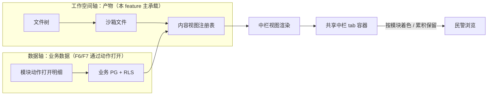

# Implementation Plan: 平台底座（三栏工作台）

**Branch**: `001-platform-foundation` | **Date**: 2026-09-26 | **Spec**: `spec.md`

**Input**: Feature specification from `docs/superpowers/specs/001-platform-foundation/spec.md`

## Summary

把 opencode 原生前端（SolidJS）的三栏结构「重定义」为 openhive 的三栏工作台：左导航 / 中浏览（共享中栏 + 多形态内容区）/ 右 AI 会话，配合图标栏五入口 + 顶栏。核心是「换皮 + 新增组件 + 注册式扩展」，不重写 opencode 既有前端逻辑。

## Technical Context

**Language/Version**: TypeScript（Bun monorepo）

**Primary Dependencies**: SolidJS（opencode 原生前端，复用）

**Storage**: 无新存储（F1 是前端框架；中栏 tab 为前端内存态）

**Testing**: oxlint（lint）+ turbo typecheck + 受影响 package 的 bun test

**Target Platform**: 桌面浏览器（公安内网 PC）

**Project Type**: web-app（opencode fork 前端改造）

**Performance Goals**: 首屏 3 秒内完成三栏渲染

**Constraints**: 复用 opencode 原生、最小化合并冲突、品牌化走配置

**Scale/Scope**: 1600 用户（并发活跃 320~480）

## Constitution Check

*GATE: 逐条对照 constitution.md，违反 MUST 级原则 = CRITICAL 阻断。*

| 宪法原则 | 本 feature 的符合情况 | 结论 |
|---|---|---|
| I. 最小化上游合并冲突（NON-NEGOTIABLE） | 三栏重定义 = 换皮配置 + 新增组件（rail 入口、共享中栏容器、视图注册表），不侵入 `sql.ts` 等高频文件 | ✅ 无冲突 |
| II. 品牌化走配置（NON-NEGOTIABLE） | Logo / 品牌名走配置 / `package.json` name，不硬编码进源码 | ✅ 无冲突 |
| III. 物理隔离优先 | F1 前端框架不涉及用户数据隔离（隔离在 F3 feature） | ✅ 不适用（无冲突） |
| IV. 权限下沉执行层 | 图标栏入口可见性受 capability 过滤（执行层拦截），前端只做显示、不替代鉴权 | ✅ 无冲突 |
| V. 侵入是「加」不是「改」 | 新增视图注册表 / 组件；改造 rail 为五入口属换皮；不改 opencode core 既有逻辑 | ✅ 无冲突 |

**结论**: 无 MUST 级原则违规，无需 Complexity Tracking 记录。

## 项目文件结构（要素①）

> 以下为「建议改造落点」，具体源码路径需实现时对照 opencode 前端源码锁定（见风险 R4）。opencode 前端已知结构（design-v2 §8.1）：`sidebar-rail`（图标栏）、session 主内容区（中栏）、`SessionSidePanel`（右栏）。

```text
packages/app/src/
├── rail/                       # 图标栏（改造 sidebar-rail）
│   └── entries.ts              # 五入口注册 + 系统设置；入口可见性受 capability 过滤
├── topbar/                     # 顶栏
│   └── topbar.tsx              # 品牌 Logo / 站内信 / 全屏 / 用户下拉
├── workspace/                  # 三栏布局容器
│   └── three-pane.tsx          # 左/中/右三栏骨架
├── center/                     # 共享中栏（跨模块 tab 容器 + 视图注册表）
│   ├── tab-bar.tsx             # 跨模块 tab 栏 + 模块着色 + 溢出收「⋯」
│   ├── tab-store.ts            # 共享 tab 状态：跨模块累积、切模块不清空
│   ├── view-registry.ts        # 内容类型(扩展名) → 视图组件 映射（注册式接口）
│   └── views/                  # 各内容类型视图
│       ├── document-view.tsx   # Word/PDF 预览
│       ├── sheet-view.tsx      # Excel 表格预览
│       ├── slide-view.tsx      # PPT 演示预览
│       ├── mindmap-view.tsx    # 思维导图
│       ├── richtext-view.tsx   # 图文混排 / 分析记录
│       ├── image-view.tsx      # 图片预览
│       └── data-view.tsx       # 数据明细 / 可视化（占位，F6/F7 填充）
```

**Structure Decision**: 单包内新增组件目录（`rail/`、`center/`、`topbar/`），改造落在 opencode 前端既有结构之上；核心 tab 状态（`tab-store`）与视图注册表（`view-registry`）独立成文件，避免侵入 session 状态管理。

## 数据流向（要素②）

中栏 tab 的内容有两条来源轴，汇聚到「内容视图注册表 → 中栏渲染」：



- **工作空间轴**（本 feature 直接实现）：文件树点文件 → 沙箱文件 → 视图注册表 → 渲染。
- **数据轴**（F6/F7 填充）：模块动作打开数据明细 → 业务 PG（RLS）→ 数据视图。F1 只提供 `data-view` 挂载点，不实现数据查询。
- 两轴不绑定：产物落地只记 project_id，数据访问由数据轴成员表决定（见 constitution §三）。

## 依赖清单（要素③）

| 依赖 | 用途 | 说明 |
|---|---|---|
| Bun（monorepo） | 构建 / 运行 | opencode 既有工程，复用 |
| SolidJS | 前端框架 | opencode 原生，复用不换 |
| docx-preview / SheetJS | Word/Excel 预览 | 纯前端，design-v2 §9.5 建议方案，实现时验证 |
| markmap | 思维导图 | Markdown → 导图 |
| TipTap | 图文混排 / 分析记录 | 富文本 + frontmatter |
| AntV G6 / ECharts | 图谱 / 图表 | F6/F7 填充，本 feature 仅占位 |

> 具体库版本实现时对照 opencode 现有依赖锁定；全部内网可自建，无外部 SaaS 依赖。

## 与现有系统集成点（要素④）

- **opencode 内核三处必改边界**（用户中间件 / Database 按用户路由 / 工具执行守卫）：F1 前端框架不直接改后端，但图标栏五入口的可见性由「会话 capability」过滤——前端读 capability 决定显示哪些入口，鉴权仍在下游执行层强制（宪法 IV）。
- **复用 opencode 原生能力**：sidebar-rail、session 主内容区、SessionSidePanel、模型选择器、Effort、通知、设置、文件树、会话管理、全屏、导出会话——全部原生已有，直接复用/换皮。
- **复用前端 spec 002-openhive-frontend-ui**：视觉规范（蜂蜜金 #D97706、暖白 #FCFCFC、暖黑 #1C1A18、六边形 logo、单色图标）与信息架构作为三栏换皮的样式来源。

## 风险点清单（要素⑤）

| ID | 风险 | 缓解 |
|---|---|---|
| R1 | opencode 前端结构高频变更，三栏重定义易产生合并冲突 | 换皮走配置、新增组件独立成文件、不侵入 core 既有逻辑 |
| R2 | 共享中栏 tab 状态跨模块保留，若侵入 session 状态管理易牵一发动全身 | 独立 `tab-store`，不碰 session 状态 |
| R3 | 中栏多形态视图预览库兼容性（docx-preview/SheetJS 对复杂文档的保真度） | design-v2 §9.5 已标「实现时验证」，用真实样本验证后锁定 |
| R4 | 具体源码文件路径未定（opencode 前端内部结构需实现时定位） | plan 给建议落点，实现第一步先定位三栏真实组件再落地 |
