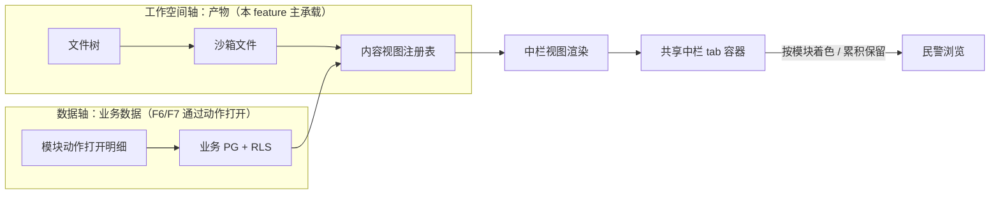

# Implementation Plan: 平台底座（三栏工作台）

**Branch**: `001-platform-foundation` | **Date**: 2026-09-26 | **Spec**: `spec.md`

**Input**: Feature specification from `docs/superpowers/specs/001-platform-foundation/spec.md`

> **修订记录 2026-09-27（T001 落点核实后）**：原 plan 假设三栏靶子在 opencode 的 **legacy 布局**（`pages/layout.tsx` / `sidebar-shell.tsx`）。T001 核实发现该布局**已被上游退休、运行时不可达**，实际渲染的是 **new 布局**（`pages/layout-new.tsx`，仅 Titlebar + 单个 `<main>`，无 rail、无左栏）。
> 经决策**三栏改建于 new 布局**（合宪法 I/V：加不是改），本文件相应段落已修订。证据与完整落点见 `refactor-targets.md`。**需求（FR）与验收标准（SC）未变。**

## Summary

把 opencode 原生前端（SolidJS）的**当前生效布局（new 布局 / v2）**改造为 openhive 的三栏工作台：左导航 / 中浏览（共享中栏 + 多形态内容区）/ 右 AI 会话，配合图标栏五入口 + 顶栏。核心是「**新增三栏骨架组件** + 换皮（v2 语义 token）+ 注册式扩展」，不重写 opencode 既有前端逻辑，也不改造已退休的 legacy 布局。

**落点原则**：以「新增独立文件 + 在 new 布局做最小挂载」为主，避免改 `titlebar.tsx` / `layout-new.tsx` 等上游活跃文件的主体逻辑（宪法 I/V）。

## Technical Context

**Language/Version**: TypeScript（Bun monorepo）

**Primary Dependencies**: SolidJS（opencode 原生前端，复用）

**Storage**: 无新存储（F1 是前端框架；中栏 tab 为前端内存态）

**Testing**: oxlint（lint）+ turbo typecheck + 受影响 package 的 bun test

**Target Platform**: 桌面浏览器（公安内网 PC）

**Project Type**: web-app（opencode fork 前端改造）

**Performance Goals**: 首屏 3 秒内完成三栏渲染

**Constraints**: 复用 opencode 原生、最小化合并冲突、品牌化走配置

**Scale/Scope**: 1600 用户（并发活跃 320~480）

## Constitution Check

*GATE: 逐条对照 constitution.md，违反 MUST 级原则 = CRITICAL 阻断。*

| 宪法原则 | 本 feature 的符合情况 | 结论 |
|---|---|---|
| I. 最小化上游合并冲突（NON-NEGOTIABLE） | 三栏重定义 = 换皮配置 + 新增组件（rail 入口、共享中栏容器、视图注册表），不侵入 `sql.ts` 等高频文件 | ✅ 无冲突 |
| II. 品牌化走配置（NON-NEGOTIABLE） | Logo / 品牌名走配置 / `package.json` name，不硬编码进源码 | ✅ 无冲突 |
| III. 物理隔离优先 | F1 前端框架不涉及用户数据隔离（隔离在 F3 feature） | ✅ 不适用（无冲突） |
| IV. 权限下沉执行层 | 图标栏入口可见性受 capability 过滤（执行层拦截），前端只做显示、不替代鉴权 | ✅ 无冲突 |
| V. 侵入是「加」不是「改」 | 修订后**全部以「新增」实现**（三栏骨架 / rail 五入口 / 中栏 tab 容器 / 视图注册表）；对 new 布局只做最小挂载，不改其主体逻辑；不改 opencode core 既有逻辑 | ✅ 无冲突（修订后更贴合） |

**结论**: 无 MUST 级原则违规，无需 Complexity Tracking 记录。

## 项目文件结构（要素①）

> **已锁定**（T001 核实，非建议）。opencode 前端**当前生效布局**为 new 布局：`pages/layout-new.tsx:41` 的 `<main>` 是中栏挂载点；顶栏为 `components/titlebar.tsx`，其 v2 分支在 `:614` 提供 `#opencode-titlebar-right` 注入点。**legacy 布局（`pages/layout.tsx` / `pages/layout/sidebar-shell.tsx`）已被上游退休、运行时不可达，本项目不改造它**（详见 `refactor-targets.md` §1）。

```text
packages/app/src/
├── rail/                       # 图标栏【新增】—— new 布局无承载物，全新实现
│   └── entries.ts              # 五入口注册 + 系统设置；入口可见性受 capability 过滤
├── topbar/                     # 顶栏扩展【新增】
│   └── topbar.tsx              # 品牌 Logo / 站内信 / 全屏 / 用户下拉
│                               # 挂载点：titlebar.tsx:614 #opencode-titlebar-right（v2 分支现成）
├── workspace/                  # 三栏布局容器【新增】
│   └── three-pane.tsx          # 左/中/右三栏骨架
│                               # 挂载点：layout-new.tsx:41 <main> 上下游（最小挂载）
├── center/                     # 共享中栏（跨模块 tab 容器 + 视图注册表）【新增】
│   ├── tab-bar.tsx             # 跨模块 tab 栏 + 模块着色 + 溢出收「⋯」
│   ├── tab-store.ts            # 共享 tab 状态：跨模块累积、切模块不清空
│   ├── view-registry.ts        # 内容类型(扩展名) → 视图组件 映射（注册式接口）
│   └── views/                  # 各内容类型视图
│       ├── document-view.tsx   # Word/PDF 预览
│       ├── sheet-view.tsx      # Excel 表格预览
│       ├── slide-view.tsx      # PPT 演示预览
│       ├── mindmap-view.tsx    # 思维导图
│       ├── richtext-view.tsx   # 图文混排 / 分析记录
│       ├── image-view.tsx      # 图片预览
│       └── data-view.tsx       # 数据明细 / 可视化（占位，F6/F7 填充）
```

**Structure Decision**: 全部为**单包内新增组件目录**（`rail/`、`center/`、`topbar/`、`workspace/`），以「新增独立文件 + 在 new 布局做最小挂载」方式接入；核心 tab 状态（`tab-store`）与视图注册表（`view-registry`）独立成文件，**既避免侵入 session 状态管理，也避免复用现有两条 tab 系统**（`context/tabs.tsx` 键是 session/draft；`context/layout-tabs.ts` 是 per-session、切 session 即丢，二者均不满足 FR-004/006）。

**⚠️ 与 new 布局的既有职责重叠需处理**：new 布局下 session tab 条挂在顶栏（`titlebar.tsx:398` `TitlebarTabStrip`），与 openhive「共享中栏 tab」共存时会争顶栏空间——实现 T009 时需明确二者关系（建议：openhive 中栏 tab 容器只承载「内容视图 tab」，不动 session tab）。

## 前端换皮区（opencode 组件 → openhive token 换皮映射）

> 视觉真理来源：`../openhive-DESIGN.md` + opencode **v2** `theme.css` 语义变量。**换皮** = 改 opencode 已有组件的 token（颜色/字体/圆角/logo/品牌名）；**新增** = opencode 没有的 openhive 组件。

### ① opencode 原生组件 → openhive 改造（三栏靶子，已按 T001 核实修正）

| opencode 组件 | 位置（new 布局路径） | openhive 改造 | 类型 |
|---|---|---|---|
| 图标栏 rail | ❌ **new 布局无**（原靶子 `sidebar-shell.tsx` 属已退休 legacy） | 图标栏五入口（项目/AI 资产/AI 会话/话单/资金）+ 系统设置，入口读 capability | **新增**（原标「换皮+新增入口」） |
| 三栏骨架 | ❌ **new 布局无**（原靶子 `pages/layout.tsx` 属已退休 legacy） | 三栏：左导航 / 中浏览 / 右 AI 会话 | **新增**（原标「换皮」） |
| 中栏挂载点 | `pages/layout-new.tsx:41` `<main>` | 在其上下游挂载三栏骨架（最小挂载） | **新增** |
| SessionSidePanel（右栏） | `pages/session/session-side-panel.tsx`（new 分支挂在 `pages/session.tsx:2328`） | 右栏 AI 会话（对话优先 Hero 输入）。**注意**：该组件当前职责是「文件树 + review」，不是会话面板（会话内容在中栏 `session.tsx:2061`） | **换皮 + 重定职责**（原标「换皮」） |
| 顶栏 / 品牌名 | `components/titlebar.tsx`（v2 分支 `#opencode-titlebar-right` 在 `:614`） | 品牌 Logo / 站内信 / 全屏 / 用户下拉——**有现成注入点，无需改 Titlebar 主体** | 换皮（品牌）+ 新增（站内信） |
| 共享中栏 tab 容器 + 视图注册表 | opencode 无（两条现存 tab 系统均不满足 FR-004/006） | 跨模块 tab 累积 + 扩展名→视图注册 | **新增** |

> **不改造的既有组件**：`pages/layout/sidebar-shell.tsx`、`pages/layout.tsx` 及其 `SidebarPanel` / `sidebar-workspace.tsx` / `sidebar-items.tsx` —— 全部属已退休 legacy，**本项目不碰**（避免把工作量投在上游将删除的代码上）。

### ② 语义 token 映射（**v2** theme.css —— 修正靶子）

生效布局是 new 布局，其语义变量为 `packages/ui/src/v2/styles/theme.css` 的 `--v2-*`（不是 legacy `packages/ui/src/styles/theme.css` 的 `--xxx`）。

| v2 语义变量 | 现在值 | openhive 值（DESIGN.md §1） |
|---|---|---|
| `--v2-background-bg-base` / `-deep` | `--v2-grey-50` / `--v2-grey-100` | `#FCFCFC` 暖白 |
| `--v2-text-text-base` | `--v2-grey-1100` | `#1C1A18` 暖黑 |
| `--v2-background-bg-accent` | `--v2-blue-600` 蓝 | 蜂蜜金 `#D97706` |
| `--v2-text-text-accent` / `--v2-icon-icon-accent` | `--v2-blue-600/700` 蓝 | 蜂蜜金/琥珀（去蓝） |
| `--v2-border-border-focus` | `--v2-blue-500` 蓝 | 琥珀 focus ring |
| font | `--v2-font-family-sans` | PingFang SC / Microsoft YaHei 系统栈 |

- 字号默认 **14px**（DESIGN.md §2.2）；圆角卡片/输入框 12~16px、按钮 8~10px（§3.1）。
- **不启用暗色**：只改 light 一套（DESIGN.md §6.2）。
- ⚠️ **实现陷阱（T001 新发现）**：v2 浅色值**同时存在于两处**——`:root`（`v2/styles/theme.css:14-145`）与 `[data-color-scheme="light"]`（`:261-380`）。`ThemeProvider` 会写 `document.documentElement.dataset.colorScheme`（`packages/ui/src/theme/context.tsx:153-159`），**只改 `:root` 会被 `[data-color-scheme="light"]` 覆盖**。须两处同改，或改 v2 原语 `v2/styles/colors.css` 的色阶。
- ⚠️ **生成物纪律（修正原表述）**：`packages/ui/src/styles/tailwind/colors.css` 才是 `script/tailwind.ts` 生成物（`:1-2` 有 generated 头），**绝不手改**；`packages/ui/src/styles/colors.css` 与 `packages/ui/src/v2/styles/colors.css` **无生成头**，是原语色阶，但同样不建议手改（无收益）。
- legacy `packages/ui/src/styles/theme.css` 仅在 new 布局少量组件仍引用时**顺带**对齐，不作为主战场。

### ③ 视觉参考样本

- `../design-reference/figma-export/`（logo-mark/light/dark.svg、tokens.css）
- front 组件对应：`LeftIconBar`（五入口）/ `LeftSidebar`（左栏）/ `Header`（顶栏）/ `CenterWorkspace`（中栏）/ `RightAIChat`（右栏）

### ④ 换皮 vs 新增汇总

| 类型 | 本 feature 具体 |
|---|---|
| 换皮 | 右栏 AI 会话（含重定职责）、顶栏品牌、**v2** token |
| 新增 | **三栏骨架**、**图标栏五入口**、共享中栏 tab 容器、视图注册表、站内信 |

> 修订后「新增」占比显著上升（三栏骨架与图标栏由换皮升为新增）——这是 new 布局无对应承载物的必然结果，非范围蔓延：FR-001/002 的要求未变。

## 数据流向（要素②）

中栏 tab 的内容有两条来源轴，汇聚到「内容视图注册表 → 中栏渲染」：



- **工作空间轴**（本 feature 直接实现）：文件树点文件 → 沙箱文件 → 视图注册表 → 渲染。
- **数据轴**（F6/F7 填充）：模块动作打开数据明细 → 业务 PG（RLS）→ 数据视图。F1 只提供 `data-view` 挂载点，不实现数据查询。
- 两轴不绑定：产物落地只记 project_id，数据访问由数据轴成员表决定（见 constitution §三）。

## 依赖清单（要素③）

| 依赖 | 用途 | 说明 |
|---|---|---|
| Bun（monorepo） | 构建 / 运行 | opencode 既有工程，复用 |
| SolidJS | 前端框架 | opencode 原生，复用不换 |
| docx-preview / SheetJS | Word/Excel 预览 | 纯前端，design-v2 §9.5 建议方案，实现时验证 |
| markmap | 思维导图 | Markdown → 导图 |
| TipTap | 图文混排 / 分析记录 | 富文本 + frontmatter |
| AntV G6 / ECharts | 图谱 / 图表 | F6/F7 填充，本 feature 仅占位 |

> 具体库版本实现时对照 opencode 现有依赖锁定；全部内网可自建，无外部 SaaS 依赖。

## 与现有系统集成点（要素④）

- **opencode 内核三处必改边界**（用户中间件 / Database 按用户路由 / 工具执行守卫）：F1 前端框架不直接改后端，但图标栏五入口的可见性由「会话 capability」过滤——前端读 capability 决定显示哪些入口，鉴权仍在下游执行层强制（宪法 IV）。
- **复用 opencode 原生能力**（**限 new 布局侧**）：中栏 `<main>`、SessionSidePanel、模型选择器、Effort、通知、设置、文件树、会话管理、全屏、导出会话、顶栏 `Titlebar` 及其 `#opencode-titlebar-right` 注入点——均在 new 布局存活，直接复用/换皮。
  **不复用**：legacy 的 sidebar-rail / SidebarPanel / LegacyLayout（已退休，见 `refactor-targets.md` §1）。
- **复用前端 spec 002-openhive-frontend-ui**：视觉规范（蜂蜜金 #D97706、暖白 #FCFCFC、暖黑 #1C1A18、六边形 logo、单色图标）与信息架构作为三栏换皮的样式来源。

## 风险点清单（要素⑤）

| ID | 风险 | 缓解 |
|---|---|---|
| R1 | opencode 前端结构高频变更，三栏重定义易产生合并冲突 | 换皮走配置、新增组件独立成文件、不侵入 core 既有逻辑 |
| R2 | 共享中栏 tab 状态跨模块保留，若侵入 session 状态管理易牵一发动全身 | 独立 `tab-store`，不碰 session 状态 |
| R3 | 中栏多形态视图预览库兼容性（docx-preview/SheetJS 对复杂文档的保真度） | design-v2 §9.5 已标「实现时验证」，用真实样本验证后锁定 |
| R4 | ~~具体源码文件路径未定~~ **已由 T001 关闭** | 落点已锁定为 new 布局（`refactor-targets.md`）。**残余风险转为**：new 布局的 `titlebar.tsx` / `layout-new.tsx` 是上游活跃文件，最小挂载处仍可能冲突 → 缓解：挂载只加不改，新增逻辑全部落在本项目自有目录（`rail/` `center/` `topbar/` `workspace/`） |
| R5 | new 布局下 session tab 条已在顶栏（`titlebar.tsx:398`），与 openhive 共享中栏 tab 争空间 | T009 实现时明确分工：顶栏只管 session tab，openhive 中栏 tab 容器只管「内容视图 tab」；若空间不足，中栏 tab 容器自带溢出收「⋯」（FR-005） |
| R6 | v2 浅色 token 分散在 `:root` 与 `[data-color-scheme="light"]` 两处，漏改一处导致换皮不生效 | 换皮任务须两处同改（或改 v2 原语色阶）；完成后用真实浏览器核对（`data-color-scheme` 已生效） |
