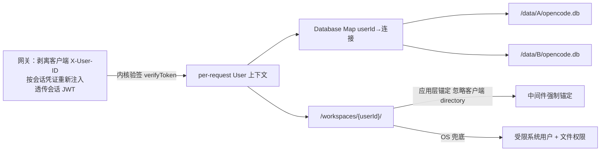

# Implementation Plan: 多用户隔离

**Branch**: `003-multi-tenant-isolation` | **Date**: 2026-09-26 | **Spec**: `spec.md`

**Input**: Feature specification from `docs/superpowers/specs/003-multi-tenant-isolation/spec.md`

## Summary

把 opencode 进程级单例数据库改造为「每用户独立 db + 每用户沙箱目录」的物理隔离：新增 per-request 用户上下文，Database 按用户路由连接，中间件锚定工作目录，OS 受限用户兜底。这是 opencode「唯一深改 core」处，落 constitution 三处必改边界的前两处（用户中间件 + Database 按用户路由）。

## Technical Context

**Language/Version**: TypeScript（Bun monorepo，核心 `packages/opencode`）

**Primary Dependencies**: opencode 原生 `Database`（`makeGlobalNode` 单例）、`LayerNode.unbound`（仿 `Location` 的 per-request 模式）、Linux OS 权限 / quota / docker volume

**Storage**: SQLite 每用户独立文件 `/data/{userId}/opencode.db`（不换 PG）

**Testing**: oxlint + turbo typecheck + bun test + **隔离测试**（用户 A 访问 B 必须被拒，失败即阻断）

**Target Platform**: 公安内网（Linux 容器，受限用户运行）

**Project Type**: web-service（opencode core 改造）

**Performance Goals**: 连接惰性打开 + 复用，不预建；查询路由无额外可感知延迟

**Constraints**: 零表结构改动、物理隔离优先、侵入是「加」不是「改」

**Scale/Scope**: 1600 用户（并发活跃 320~480，超出单进程舒适区，需压测）

## Constitution Check

*GATE: 逐条对照 constitution.md，违反 MUST 级原则 = CRITICAL 阻断。*

| 宪法原则 | 本 feature 的符合情况 | 结论 |
|---|---|---|
| I. 最小化上游合并冲突（NON-NEGOTIABLE） | 改造收敛到「用户中间件 + Database 按用户路由」两处；零表结构改动，不碰 `sql.ts` | ✅ 无冲突 |
| II. 品牌化走配置（NON-NEGOTIABLE） | F3 不涉及品牌 | ✅ 不适用 |
| III. 物理隔离优先 | 本 feature 即物理隔离落地：每用户 db + 沙箱目录 + OS 文件权限兜底，不靠应用层 `if` 过滤 | ✅ 完全符合 |
| IV. 权限下沉执行层 | F3 是数据层强制（db 路由 + OS 权限），配合 F4 的工具执行守卫构成三层拦截 | ✅ 无冲突 |
| V. 侵入是「加」不是「改」 | 新增 per-request User 上下文 + `Map<userId, 连接>`，仿 `Location` 的 `LayerNode.unbound` 模式；不改 core 既有模块 | ✅ 无冲突 |

**结论**: 无 MUST 级原则违规。本 feature 是 constitution 原则 III（物理隔离优先）的正面落地。

## 项目文件结构（要素①）

```text
packages/opencode/src/
├── user/
│   └── context.ts              # per-request User 上下文（仿 Location 的 LayerNode.unbound，中间件填 X-User-ID）
├── database/
│   └── router.ts               # Database 维护 Map<userId, 连接>，惰性打开 + 复用 + 各自 PRAGMA
├── middleware/
│   └── anchor-workspace.ts     # 工作目录强制锚定到 /workspaces/{userId}/
├── quota/
│   ├── session-quota.ts        # 每用户并发 Session 计数（中间件 + SessionExecution）
│   └── disk-quota.ts           # 沙箱磁盘配额（Linux quota / docker volume）
```

> 改造三步（design-v2 §5.2）：① 新增 per-request `User` 上下文；② `Database` 维护 `Map<userId, 连接>` 指向 `/data/{userId}/opencode.db`（惰性打开 + 复用 + 各自 PRAGMA）；③ db 查询从 User 上下文取 userId 路由到对应连接。**零表结构改动**——`session` 表不加 `user_id` 列，不碰 `sql.ts`。

**Structure Decision**: 改造集中在 `user/`、`database/router.ts`、`middleware/`、`quota/` 四个新增模块，不重写 `database.ts` 既有逻辑（用「加」的方式）。

## 数据流向（要素②）



- **数据隔离**：网关透传的会话 JWT → **内核验签**（`verifyToken` + `AUTH_JWT_SECRET`）→ User 上下文 → `Map[userId]` 路由到对应 db 文件，物理上拿不到他人的连接。`X-User-ID` 只是路由提示，**不作为身份来源**。
- **工作空间轴**：沙箱 `/workspaces/{userId}/` 由应用层锚定 + OS 文件权限双层锁定；项目是该沙箱内的唯一隔离边界 + git 仓库。
- **数据轴**：F3 不直接涉及业务 PG（话单/资金在 F6/F7），但每用户身份是数据轴授权的「用户主体」来源。

## 依赖清单（要素③）

| 依赖 | 用途 | 说明 |
|---|---|---|
| Bun（monorepo） | 构建 / 运行 | opencode 既有工程 |
| opencode `Database` / `LayerNode` | 改造基座 | 复用原生能力，仿 `Location.unbound` |
| Linux quota / docker volume | 磁盘配额 | 沙箱磁盘限制 |
| OS 受限用户 + 文件权限 | OS 层兜底 | 只放行用户自己名下目录 |

> 具体版本实现时对照 opencode 现有依赖锁定。

## 与现有系统集成点（要素④）

- **三处必改边界的前两处**：① 用户中间件——F2 交的是**门**（「关 Basic Auth + 读 `X-User-ID` 即拒」）与 **JWT 机制**（签发 / 验签 / 密钥地板），**注入器与验签在 F3 落地**（T014 网关注入 + 透传，T003 内核验签）；② Database 按用户路由（F3 落地）。第三处「工具执行守卫」在 F4。
- **复用 opencode 原生**：project 概念（唯一隔离边界 + git 仓库）、`session.project_id`（逻辑隔离）、`LayerNode.unbound`（per-request 上下文模式）。
- **隔离测试**：对接 constitution §五质量门禁——「用户 A 访问用户 B 的目录/db 必须被拒，失败即阻断合并」。

## 风险点清单（要素⑤）

| ID | 风险 | 缓解 |
|---|---|---|
| R1 | 改造 `Database` 单例为 per-user `Map` 是「唯一深改 core」处，与上游合并冲突风险最高 | 用「加」的方式新增 `router.ts`，不重写 `database.ts`；改造点单独提交、标注为保留定制 |
| R2 | 连接惰性打开/复用管理不当导致连接泄漏或未关闭 | 连接按 userId 索引 + 惰性打开 + 显式复用与回收，纳入隔离测试 |
| R3 | OS 受限用户 + 文件权限配置过松（越权）或过紧（自己都写不了） | 用最小权限原则，隔离测试双向验证（A 读不了 B、A 能读自己） |
| R4 | 并发/磁盘配额阈值未定 | design-v2 §6 已标「需压测确认」，阈值先设保守默认值，压测后调 |
