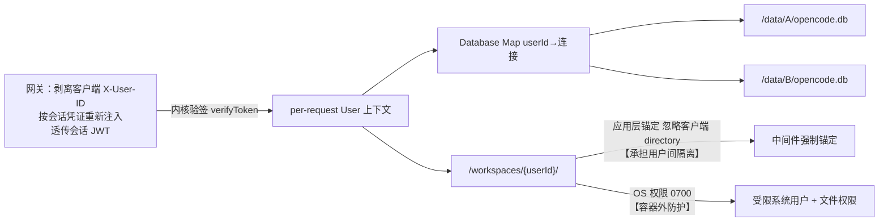

# Implementation Plan: 多用户隔离

**Branch**: `003-multi-tenant-isolation` | **Date**: 2026-09-26 | **Spec**: `spec.md`

**Input**: Feature specification from `docs/superpowers/specs/003-multi-tenant-isolation/spec.md`

## Summary

把 opencode 进程级单例数据库改造为「每用户独立 db + 每用户沙箱目录」的物理隔离：新增 per-request 用户上下文，Database 按用户路由连接，中间件锚定工作目录，容器以受限用户运行（**容器外防护**，不承担用户间隔离——2026-09-30 裁定乙，见 `isolation-scheme.md` §5）。这是 opencode「唯一深改 core」处，落 constitution 三处必改边界的前两处（用户中间件 + Database 按用户路由）。

## Technical Context

**Language/Version**: TypeScript（Bun monorepo，核心 `packages/opencode`）

**Primary Dependencies**: opencode 原生 `Database`（`makeGlobalNode` 单例）、`LayerNode.unbound` + `LayerMap`（**模式 B**，用于 `Database` 的按用户替换 —— T004/T005；⚠️ T003 的 `User` 上下文**不用**模式 A，见 `refactor-targets.md` §5）、Linux OS 权限 / quota / docker volume

**Storage**: SQLite 每用户独立文件 `/data/{userId}/opencode.db`（不换 PG）

**Testing**: oxlint + turbo typecheck + bun test + **隔离测试**（用户 A 访问 B 必须被拒，失败即阻断）

**Target Platform**: 公安内网（Linux 容器，受限用户运行）

**Project Type**: web-service（opencode core 改造）

**Performance Goals**: 连接惰性打开 + 复用，不预建；查询路由无额外可感知延迟

**Constraints**: 零表结构改动、物理隔离优先、侵入是「加」不是「改」

**Scale/Scope**: 1600 用户（并发活跃 320~480，超出单进程舒适区，需压测）

## Constitution Check

*GATE: 逐条对照 constitution.md，违反 MUST 级原则 = CRITICAL 阻断。*

| 宪法原则 | 本 feature 的符合情况 | 结论 |
|---|---|---|
| I. 最小化上游合并冲突（NON-NEGOTIABLE） | 改造收敛到「用户中间件 + Database 按用户路由」两处；零表结构改动，不碰 `sql.ts` | ✅ 无冲突 |
| II. 品牌化走配置（NON-NEGOTIABLE） | F3 不涉及品牌 | ✅ 不适用 |
| III. 物理隔离优先 | 本 feature 即物理隔离落地：**每用户 db（连接级物理分离）** + 沙箱目录应用层锚定 + OS 权限容器外防护。⚠️ **不靠应用层 `if` 过滤这一条成立的关键是「每用户 db」**——它是连接级分离，不是判断；沙箱侧的锚定是应用层，但它不是隔离的唯一承担者（2026-09-30 裁定乙） | ✅ 符合 |
| IV. 权限下沉执行层 | F3 是数据层强制（db 路由 + OS 权限），配合 F4 的工具执行守卫构成三层拦截 | ✅ 无冲突 |
| V. 侵入是「加」不是「改」 | 新增 per-request User 上下文（`Context.Service`，T003 已落地）+ `Map<userId, 连接>`（T004，仿 `Location` 的 `unbound`/`boundNode` + `LayerMap`）；不改 core 既有模块——**新增文件，零改动既有模块** | ✅ 无冲突 |

**结论**: 无 MUST 级原则违规。本 feature 是 constitution 原则 III（物理隔离优先）的正面落地。

## 项目文件结构（要素①）

```text
packages/core/src/
└── user.ts                     # per-request User 上下文（Context.Service；中间件**验签后**填入）
                                # ⚠️ 放 core 不放在 opencode/src/user/：T005 要 core 的 Database 读得到它

packages/opencode/src/
├── server/routes/instance/httpapi/middleware/
│   └── user-identity.ts        # 身份门（验签取 userId，认不出即 401）——取代 002 的「读头即放行」
├── database/
│   └── router.ts               # Database 维护 Map<userId, 连接>，惰性打开 + 复用 + 各自 PRAGMA
├── middleware/
│   └── anchor-workspace.ts     # 工作目录强制锚定到 /workspaces/{userId}/
├── quota/
│   ├── session-quota.ts        # 每用户并发 Session 计数 + 判定（D4 裁定）
│   │                           # 维度：数「当前正在跑的」；拦点：启动执行时
│   │                           # 覆盖面：**两条链各挂一次**（A: SessionPrompt/SessionRunState
│   │                           #   ← SessionStatus；B: core SessionV2.prompt ← SessionExecution.active）
│   └── disk-quota.ts           # 沙箱磁盘配额（**应用层**；D4 裁定丙）
│                               # OS 级强制（Linux quota / docker volume）登记为部署缺口，见 R4
```

> ⚠️ **勘误（2026-09-30 · T010 落地时）**：`session-quota.ts` 实际落在
> **`packages/core/src/quota/session-quota.ts`**，**不是**上面树里的 `packages/opencode/src/quota/`。
> 理由：**B 链的拦截点在 core**（`SessionV2.prompt`），而 core **不能** import `@opencode-ai/opencode`
> （`packages/core/package.json` 无该依赖）⇒ 两条链要共用一份判定，只能放两者共同依赖的 core。
> opencode 侧只放**两种形态的适配器** `.../httpapi/middleware/session-quota.ts`：
> A 链**端点级** `.middleware(...)`（实例上下文是端点级 `HttpApiMiddleware` 注入的，路由级挂会 500）、
> B 链路由级。详见 `state.md` 的「T010 结论」。

> ⚠️ **勘误（2026-09-30 · T011 落地时）**：`disk-quota.ts` 落在
> **`packages/core/src/quota/disk-quota.ts`**——与上面树里写的 `packages/opencode/src/quota/` 不同，
> **理由与 T010 那条同源且更硬**：守卫要挂在 **`packages/core/src/fs-util.ts` 的 `writeWithDirs`** 上
> （`write` / `edit` / `apply_patch` 三个工具共用的**唯一写入漏斗** ⇒ 一处接线覆盖三个工具），
> 而 core **不能** import `@opencode-ai/opencode`。接线改动：`fs-util.ts` **+1 处调用 + 错误联合 +1 项**，
> 均带【保留的定制 · 同步上游时不要丢】注释（`fs-util.ts` 是上游热文件，改动已压到最小）。
> 配套：`packages/opencode/test/disk-quota-drift.test.ts` 一条**防漂移断言**——core 抄了一份沙箱根常量，
> 与 `packages/auth/src/workspace.ts` 那份必须相等。详见 `state.md` 的「T011 结论」。

> 改造三步（design-v2 §5.2）：① 新增 per-request `User` 上下文；② `Database` 维护 `Map<userId, 连接>` 指向 `/data/{userId}/opencode.db`（惰性打开 + 复用 + 各自 PRAGMA）；③ db 查询从 User 上下文取 userId 路由到对应连接。**零表结构改动**——`session` 表不加 `user_id` 列，不碰 `sql.ts`。

**Structure Decision**: 改造集中在 `user/`、`database/router.ts`、`middleware/`、`quota/` 四个新增模块，不重写 `database.ts` 既有逻辑（用「加」的方式）。

## 数据流向（要素②）



> ⚠️ **2026-09-30 裁定（乙）**：单进程模型下 OS 文件权限**不区分用户 A 与 B**（一个容器 = 一个进程 = 一个 OS 主体）。
> 上图中「承担用户间隔离」的那一格是**应用层锚定**，不是 OS 权限。证据链见 `isolation-scheme.md` §5。

- **数据隔离**：网关透传的会话 JWT → **内核验签**（`verifyToken` + `AUTH_JWT_SECRET`）→ User 上下文 → `Map[userId]` 路由到对应 db 文件，物理上拿不到他人的连接。`X-User-ID` 只是路由提示，**不作为身份来源**。
- **工作空间轴**：沙箱 `/workspaces/{userId}/` 由**应用层锚定**（承担用户间隔离）+ OS 文件权限（`0700`，容器外防护）双层锁定；项目是该沙箱内的唯一隔离边界 + git 仓库。**单进程模型下 OS 权限不承担用户间隔离**（2026-09-30 裁定乙，见 `isolation-scheme.md` §5）。
- **数据轴**：F3 不直接涉及业务 PG（话单/资金在 F6/F7），但每用户身份是数据轴授权的「用户主体」来源。

## 依赖清单（要素③）

| 依赖 | 用途 | 说明 |
|---|---|---|
| Bun（monorepo） | 构建 / 运行 | opencode 既有工程 |
| opencode `Database` / `LayerNode` | 改造基座 | 复用原生能力；`Database` 的按用户替换仿 `Location` 的 `unbound`/`boundNode`（T004/T005），per-request 上下文用 `Context.Service`（T003，已落地） |
| Linux quota / docker volume | 磁盘配额 | 沙箱磁盘限制。⚠️ **D4 裁定丙后这是「挂账」那一半**：T011 落地的是**应用层**统计+拒绝，本条 OS 级强制**登记为部署缺口**（本机 win32、无 Docker，测不了——`LEARNINGS #002-05` 同款处境） |
| OS 受限用户 + 文件权限 | **容器外防护**（**不承担用户间隔离**——2026-09-30 裁定乙） | 容器非 root；`/workspaces/{userId}/` `0700`，挡同主机其他容器/系统用户 |

> 具体版本实现时对照 opencode 现有依赖锁定。

## 与现有系统集成点（要素④）

- **三处必改边界的前两处**：① 用户中间件——F2 交的是**门**（「关 Basic Auth + 读 `X-User-ID` 即拒」）与 **JWT 机制**（签发 / 验签 / 密钥地板），**注入器与验签在 F3 落地**（T014 网关注入 + 透传，T003 内核验签）；② Database 按用户路由（F3 落地）。第三处「工具执行守卫」在 F4。
- **复用 opencode 原生**：project 概念（唯一隔离边界 + git 仓库）、`session.project_id`（逻辑隔离）、`LayerNode.unbound` + `LayerMap`（**按 key 构造并缓存服务树**的模式——T004/T005 拿它替换 `Database`，不是 T003 的 per-request 上下文）。
- **隔离测试**：对接 constitution §五质量门禁——「用户 A 访问用户 B 的目录/db 必须被拒，失败即阻断合并」。

## 风险点清单（要素⑤）

| ID | 风险 | 缓解 |
|---|---|---|
| R1 | 改造 `Database` 单例为 per-user `Map` 是「唯一深改 core」处，与上游合并冲突风险最高 | 用「加」的方式新增 `router.ts`，不重写 `database.ts`；改造点单独提交、标注为保留定制 |
| R2 | 连接惰性打开/复用管理不当导致连接泄漏或未关闭 | 连接按 userId 索引 + 惰性打开 + 显式复用与回收，纳入隔离测试 |
| R3 | ~~OS 受限用户 + 文件权限配置过松（越权）或过紧（自己都写不了）~~ **已改造（2026-09-30 裁定乙）**：单进程下 OS 权限不承担用户间隔离，真正的风险变成「**误以为 OS 已隔离**」 | ① `0700` + 最小权限照做，但**宣称的效力降级为容器外防护**；② 隔离测试（T012/T013）的断言必须**如实写「由应用层锚定保证」**，不得假装是 OS 拦的；③ `/data/{userId}/` 目录必须可写——SQLite WAL 要在同目录建 `-wal`/`-shm`，「过紧」在这里表现为**直接打不开库**（见 `isolation-scheme.md` §0.4） |
| R4 | 并发/磁盘配额阈值未定 | **已裁定（2026-09-30 · D4，T010/T011 开工前到点裁定；同日二次裁定覆盖面）**：① 维度 = 数本用户**当前正在跑的** session，拦在**启动执行时**、**不是**建会话时；**覆盖面 = 两条链都拦**（A：`POST /session/{id}/prompt_async` → `SessionRunState`/`SessionStatus`；B：`POST /api/session/{id}/prompt` → core `SessionV2.prompt`/`SessionExecution.active`），判定 + 阈值 + 计数全在同一个 `quota/session-quota.ts`，只有「活跃集合从哪取」按链注入——⚠️ 原本只写 `SessionExecution.active`，**实测那只覆盖 B 链、而产品 UI 走 A 链**，照字面落等于主路径零配额；② 默认阈值 **`5`**（依据本文件「1600 用户 / 并发活跃 320~480」⇒ 人均不到 1，给 5 是 5 倍以上余量），⚠️ **未经压测，非结论**；③ 磁盘配额（T011）走**丙**——**应用层先做**（T011 的出参由这半达成），**OS 级强制**（Linux quota / docker volume）**登记为部署缺口**（本机 win32、无 Docker、无 quota 工具）。全文见 `dev_tdd.003.md` Step 0.5 的 D4 段 |

### 📌 补记：R3 ② 已执行（2026-09-30 · T012/T013 收尾时）

T012/T013 两个验收测试文件**顶部都如实写明「挡在中间的是应用层锚定（T006），不是 OS 权限」**，
且每条断言都只声明「**请求进不来**」，**没有一条**把结论说成「OS 已隔离」——
这正是 R3 ② 的原话要求。配套事实：T007 已登记「两条 `0700` 断言在本机不可验（win32 忽略 mode）」，
若在这里写成「OS 拦的」，两处会互相矛盾。
⚠️ 同时如实登记：T012/T013 **不覆盖** T009 的两条读路径、T010 的端到端 429、长连接下的取连接行为
（三条现在**都没有接收方**，见 `state.md`「阻塞项」第 2 条）。
