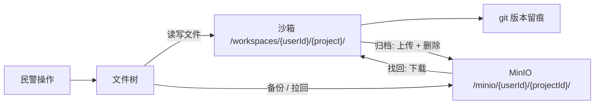

# Implementation Plan: 项目管理（工作空间轴）

**Branch**: `005-project-management` | **Date**: 2026-09-26 | **Spec**: `spec.md`

**Input**: Feature specification from `docs/superpowers/specs/005-project-management/spec.md`

## Summary

落地工作空间轴的项目管理：左栏项目锚点 + 项目列表（新建/切换）、文件树操作、共享项目成员管理（微信群模型）、文件↔MinIO 备份拖拽、项目归档/找回。项目是唯一隔离边界 + git 仓库（复用 opencode 原生 project + F3 沙箱），全部用「加」的方式落地。

## Technical Context

**Language/Version**: TypeScript（Bun monorepo）

**Primary Dependencies**: opencode 原生文件树（SolidJS）、MinIO（对象存储）、git（版本留痕）

**Storage**: project 表（opencode 原生 + 加字段）、project_member 表、MinIO（`/minio/{userId}/{projectId}/`）、沙箱文件（F3 已落地）

**Testing**: oxlint + turbo typecheck + bun test

**Target Platform**: 桌面浏览器 + MinIO 服务端（公安内网）

**Project Type**: web-app（opencode fork 前端 + 后端）

**Performance Goals**: 文件树操作流畅；归档/找回不阻塞其他操作

**Constraints**: 复用 opencode 原生、最小化合并冲突、项目是唯一隔离边界

**Scale/Scope**: 1600 用户（并发活跃 320~480）

## Constitution Check

*GATE: 逐条对照 constitution.md，违反 MUST 级原则 = CRITICAL 阻断。*

| 宪法原则 | 本 feature 的符合情况 | 结论 |
|---|---|---|
| I. 最小化上游合并冲突（NON-NEGOTIABLE） | `project` 表只加列不改列；文件树复用原生 + 补能力；MinIO 是「加」的能力，不侵入 `sql.ts` | ✅ 无冲突 |
| II. 品牌化走配置（NON-NEGOTIABLE） | 文件树换皮走视觉规范（配置/样式层），不硬编码品牌 | ✅ 无冲突 |
| III. 物理隔离优先 | 项目是 F3 沙箱内的隔离边界 + git 仓库，本 feature 在物理隔离之上组织，不破坏隔离 | ✅ 无冲突 |
| IV. 权限下沉执行层 | `project_member` 是工作空间轴权限，鉴权走 F4 执行层；文件操作权限靠 F3 沙箱锚定 | ✅ 无冲突 |
| V. 侵入是「加」不是「改」 | `project` 表加字段、`project_member` 表新增、MinIO 备份新增，不改 opencode core 既有逻辑 | ✅ 无冲突 |

**结论**: 无 MUST 级原则违规。

## 项目文件结构（要素①）

```text
packages/app/src/
├── project/
│   ├── project-anchor.tsx        # 项目锚点行（项目名 + 成员数 + ▾ + ＋）
│   ├── project-panel.tsx         # 项目面板（＋新建 + 最近/全部/已归档三 tab）
│   ├── member-panel.tsx          # 成员面板（👥 侧滑：邀请/移除/退群）
│   ├── file-tree.tsx             # 文件树（复用原生 + 工具栏 + 右键菜单）
│   └── minio-dual-tree.tsx       # 文件 ↔ MinIO 上下双树拖拽

packages/opencode/src/
├── project/
│   ├── project.ts                # project 表加字段（type/project_type/shared_directory/last_accessed_at/archived/archived_at）
│   ├── member.ts                 # project_member 表 + 微信群模型权限判定
│   └── archive.ts                # 项目归档/找回（MinIO 上传/下载 + archived 状态流转）
└── minio/
    └── backup.ts                 # MinIO 客户端（文件级备份/拉回）
```

**Structure Decision**: 前端 `app/project/` 承载左栏交互，后端 `opencode/project/` 承载数据模型与归档逻辑；`project` 表加字段、`project_member` 新增，全部「加」的方式。

## 前端换皮区（左栏项目 / 文件树 / MinIO 双树）

> 视觉真理来源：`../openhive-DESIGN.md` + opencode `theme.css`。本 feature 前后端混合，前端集中在左栏交互。

### ① opencode 原生组件 → openhive 改造

| opencode 组件 | openhive 改造 | 类型 |
|---|---|---|
| 原生文件树（SolidJS） | 复用 + 换皮（token）+ 补工具栏 / 右键菜单 | 换皮 + 新增能力 |
| opencode 无项目锚点 / 面板 | 项目锚点行 + 项目面板（新建 / 最近 / 全部 / 已归档） | 新增 |
| opencode 无成员面板 | 成员面板（👥 侧滑：邀请 / 移除 / 退群） | 新增 |
| opencode 无 MinIO 双树 | 文件 ↔ MinIO 上下双树拖拽（已备份标 ✓） | 新增 |

### ② 语义 token（左栏 / 文件树，DESIGN.md §1/§2/§3）

| 用途 | openhive 值 |
|---|---|
| 左栏底色 / 文件树 | 暖白 `#FCFCFC` 底、14px 小字（§2.2） |
| 选中态 | 浅金 `#FEF3C7`（≈ `#F59E0B` 低透明度） |
| 高亮 / 链接 | 蜂蜜金 `#D97706` |
| 项目图标 | 六边形轮廓包裹（§5.3） |
| 圆角 | 面板 / 卡片 12~16px，按钮 8~10px |

### ③ 视觉参考样本

- `../design-reference/figma-export/`
- front 组件：`LeftSidebar`（左栏文件树 / 项目列表 / MinIO 双树）

### ④ 换皮 vs 新增

| 类型 | 本 feature 具体 |
|---|---|
| 换皮 | 原生文件树（token）、左栏样式 |
| 新增 | 项目锚点 / 面板、成员面板、MinIO 双树拖拽 |

## 数据流向（要素②）



- **工作空间轴**：项目是沙箱内的唯一隔离边界 + git 仓库，产物/文件在该目录内，git 留痕。
- **MinIO 备份**：文件级备份/拉回与项目级归档/找回两条链路，均落在 `/minio/{userId}/{projectId}/` 镜像沙箱路径。
- **数据轴不涉及**：本 feature 只碰工作空间轴（project/project_member），业务数据（资金/话单项目）在 F6/F7。

## 依赖清单（要素③）

| 依赖 | 用途 | 说明 |
|---|---|---|
| Bun（monorepo） | 构建 / 运行 | opencode 既有工程 |
| opencode 原生文件树（SolidJS） | 复用基座 | 补搜索/折叠/拖 MinIO + 换皮 |
| MinIO SDK | 对象存储 | 文件备份 / 归档 |
| git | 版本留痕 | 文件并发靠 git，不做实时协同 |

> 具体版本实现时对照 opencode 现有依赖锁定。

## 与现有系统集成点（要素④）

- **复用 F1 三栏**：图标栏「项目管理」入口呼出左栏（F1 已落地五入口）。
- **复用 F3 沙箱**：项目是 `/workspaces/{userId}/{project}/` 内的隔离边界 + git 仓库。
- **复用 F4 权限**：`project_member` 是工作空间轴权限，鉴权走 F4 执行层；不绑定数据轴权限。
- **`project` 表加字段**：opencode 原生 project 表加列（`type` / `project_type` / `shared_directory` / `last_accessed_at` / `archived` / `archived_at`），不重写表。

## 风险点清单（要素⑤）

| ID | 风险 | 缓解 |
|---|---|---|
| R1 | `project` 表加字段与上游合并冲突 | 只加列不改列，冲突面小；单独提交标注为保留定制 |
| R2 | MinIO 备份/归档的大文件传输性能 | 分片上传、归档异步执行、进度反馈 |
| R3 | 归档/找回的文件一致性（上传失败/中断） | 上传校验 + 幂等重试，归档前确认完整性 |
| R4 | 自动归档形态待决策（先提醒 vs 直接归档） | 默认「先提醒、owner 确认后归档」，待用户确认 |
