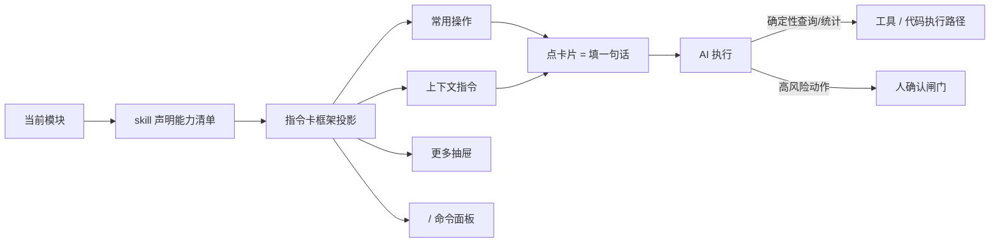

# Implementation Plan: AI 会话（右栏指令卡）

**Branch**: `006-ai-session` | **Date**: 2026-09-26 | **Spec**: `spec.md`

**Input**: Feature specification from `docs/superpowers/specs/006-ai-session/spec.md`

## Summary

落地右栏 AI 会话的通用「指令卡机制」：顶部常用操作、上下文指令、更多 skill 抽屉、`/` 命令面板。机制通用、内容随模块——各模块 skill 声明能力清单，框架自动投影。右栏会话**自建最小可用消息流**（复用 `@opencode-ai/session-ui` 原语，见「② 右栏会话的真实接入面」），是「薄界面 + 厚 skill」的可发现入口。

> ⚠️ **2026-10-07 更正（T001 定位实测）**：本文件初稿多处写「复用 opencode 原生右栏会话 /
> `SessionSidePanel`」——**实测不成立**：`SessionSidePanel` 是 review-diff ＋ 文件树，**不是消息流**；
> 且生产接线（`workspace-entry.tsx` 的 `ThreePane`）**从未给 `right` 槽传过值**。详见 §「② 右栏会话的
> 真实接入面」与 `state.md` 的 T001 出参。凡下文仍出现「复用原生右栏会话」字样的，以本节为准。

## Technical Context

**Language/Version**: TypeScript（Bun monorepo）

**Primary Dependencies**: `@opencode-ai/session-ui`（右栏会话原语：`session-turn` / `message-part` / `v2/prompt-input`）、SolidJS

**Storage**: 无新存储（指令卡是前端 UI + skill 能力清单声明）

**Testing**: oxlint + turbo typecheck + bun test

**Target Platform**: 桌面浏览器（公安内网）

**Project Type**: web-app（opencode fork 前端）

**Performance Goals**: 指令卡渲染流畅、命令面板模糊匹配即时

**Constraints**: 复用 opencode 原生、机制通用内容随模块、高风险动作人确认

**Scale/Scope**: 1600 用户

## Constitution Check

*GATE: 逐条对照 constitution.md，违反 MUST 级原则 = CRITICAL 阻断。*

| 宪法原则 | 本 feature 的符合情况 | 结论 |
|---|---|---|
| I. 最小化上游合并冲突（NON-NEGOTIABLE） | 指令卡是新增 UI 组件，不碰 `sql.ts` | ✅ 无冲突 |
| II. 品牌化走配置（NON-NEGOTIABLE） | 不涉及品牌 | ✅ 不适用 |
| III. 物理隔离优先 | 不涉及用户数据隔离 | ✅ 不适用 |
| IV. 权限下沉执行层 | 指令卡展示 skill **全集**（**不做**前端「有权」过滤——前端没有 capability 输入）；鉴权在 F4 执行层硬拦（2026-10-07 裁定 U2） | ✅ 无冲突 |
| V. 侵入是「加」不是「改」 | 新增指令卡组件 + skill 能力清单**旁路清单**（`app/src/ai-session/`，零上游改动）；右栏会话自建最小消息流，挂 `ThreePane` 的 `right` 槽——**不碰** `SessionSidePanel` / `MessageTimeline` | ✅ 无冲突 |

**结论**: 无 MUST 级原则违规。

## 项目文件结构（要素①）

```text
packages/app/src/
├── ai-session/
│   ├── capabilities.ts          # skill 能力清单「旁路清单」（2026-10-07 裁定 U4(b)：零上游改动）
│   ├── instruction-cards.tsx    # 四层共用的**视觉语法**（卡面 + 分组标题 + 溢出「⋯」）；
│   │                            # 投影框架本身落在 projection.ts（T003 的产物）
│   ├── common-cards.tsx         # 顶部「常用操作」（固定一行 + 溢出收「⋯」）
│   ├── context-cards.tsx        # 「上下文指令」（随中栏选中动态浮现）
│   ├── skill-drawer.tsx         # 「更多 skill」抽屉（按 skill 分组）
│   ├── command-palette.ts       # `/` 命令面板的**数据源**（skill 清单 → 原生弹层的建议形状）
│   │                            # ⚠️ 2026-10-07 T007 就地更正：原写 `command-palette.tsx`「新增」
│   │                            # ——原生 `v2/prompt-input` 自带的弹层本来就挂在 `/` 上（`DESIGN.md`
│   │                            # §4.7.4 的硬指令「能换数据源就不新写」），故**没有新组件**，只有这个纯函数
│   ├── session-panel.tsx        # 右栏最小可用会话（消息流 + Hero 输入，挂 ThreePane 的 right 槽）
│   ├── route-session.ts         # 从路由路径解出会话 id（T008；外壳层拿不到 `:id` 路由参数）
│   ├── right-pane-source.ts     # 「路由 id → 目录 → 数据」那条异步链（T008，可单测）
│   └── ai-session-slot.tsx      # 生产组装：三份 context 接进上面两件（T008，薄接线，见 state.md 缺口表）

skill/
└── （各模块 skill 声明能力清单，供指令卡框架投影）
```

**Structure Decision**: 指令卡机制集中在 `app/ai-session/`；右栏会话自建**最小可用消息流**（`right` 槽），复用 `@opencode-ai/session-ui` 原语。skill 能力清单声明接口是框架与各模块 skill 的契约。

### ② 右栏会话的真实接入面（2026-10-07 T001 定位实测）

> 本节是「右栏放什么」的**唯一事实来源**；上文任何「复用原生右栏会话」的旧说法以本节为准。

| 事实 | 取数（实测） |
|---|---|
| 右栏**槽位**存在但**生产未接线** | `packages/app/src/workspace/three-pane.tsx` 的 `ThreePaneProps.right?`（不传则整栏含手柄不渲染）；唯一生产调用点 `packages/app/src/workspace/workspace-entry.tsx` 只传 `left` 与 `children`。<br>✅ **2026-10-07 T008 已接线**：`workspace-entry.tsx` 新增 `right?: () => JSX.Element` 访问器 prop，`pages/layout-new.tsx` 传 `right={() => <AiSessionSlot />}`（3 条用例，含变异 M1 恰红） |
| `SessionSidePanel` **不是**消息流 | 定义在 `packages/app/src/pages/session/session-side-panel.tsx`，props 是 `canReview` / `diffs` / `reviewPanel` / `fileBrowserState` —— review-diff ＋ 文件树；仅被原生会话页 `packages/app/src/pages/session.tsx` 使用 |
| 原生消息流**耦合过重**，不适合搬进右栏 | `packages/app/src/pages/session/timeline/message-timeline.tsx` 的 `MessageTimeline` 有 **20 个 props**（过半是滚动机制 `scroll` / `setScrollRef` / `onAutoScrollHandleScroll` / `hasScrollGesture` / `onHistoryScroll` / `shouldAnchorBottom`…），组件内部直接用 `useSessionKey()` / `useSync()` / `useSDK()` 等**页面级** context |
| 可复用的**原语**在 `@opencode-ai/session-ui` | `session-turn`（`SessionTurn({sessionID, messageID, messages?, actions?, …})`）、`message-part`、`markdown`、`v2/prompt-input`（Hero 输入）；数据由 `@opencode-ai/session-ui/context` 的 `DataProvider` / `useData` 提供 |
| 会话数据与管理的**出口**是 SDK | `client.session.list / create / messages / update`（`packages/app/src/context/directory-sync.ts`、`context/server-session.ts:568`、`components/prompt-input/submit.ts:404` 是既有调用点） |
| ⚠️ 路由的 `DataProvider` 是 `WorkspaceEntry` 的**后代**，**不是祖先** | `pages/directory-layout.tsx` 的 `<DataProvider>` 挂在**路由组件**里（渲染进**中栏**的 `{props.children}`），而 `WorkspaceEntry` 在**外壳** `pages/layout-new.tsx`（由 `app.tsx` 的 `NewAppLayout` 渲染）⇒ `ThreePane` 的 `right` 槽与它**平级**，**不在其子树内**。`SessionTurn` / `MessagePart` 都 `useData()` ⇒ **右栏直接放会抛错** |

**裁定（U1(c)）**：右栏落地**最小可用会话**＝消息流（`SessionTurn` 逐个渲染）＋ Hero 输入（`v2/prompt-input`）＋ 会话新建/切换。**不引入** `MessageTimeline`，**不改** `SessionSidePanel`。

**必要的一道接线（补测得出）**：右栏须**自挂一份 `DataProvider`**。`enterprise` 的分享页
（`packages/enterprise/src/routes/share/[shareID].tsx`）与 storybook 都有**独立挂载**先例。
⇒ **T008 的 RED 用例第一件事就是这条**：不挂 `DataProvider` 时右栏必须红（证伪「原生 set 里已有」的错觉）
——**已兑现**：`session-panel.test.tsx` 的第一条**对照**就是不挂时 `SessionTurn` 当场抛
`Data context must be used within a context provider`。

> ⚠️ **2026-10-07 T008 就地更正一句（`#002-06`：改一处就 grep 全部同类）**：本节原写
> 「`useSync()` / `useSDK()` 由 `app.tsx` 的 `SelectedServerProviders` 提供，**在 `WorkspaceEntry`
> 那一层已可用**」——**实测不成立**，两处都错：
> ① `SDKProvider`（`useSDK` 的 provider，`packages/app/src/context/sdk.tsx`）挂在**路由层**
> （`app.tsx` 的 `ResolvedDraftRoute` 那一支，渲染进**中栏**的 `{props.children}`），**不在**
> `SelectedServerProviders` 里（后者逐字只给 `ServerKey → ServerSDKProvider → ServerSyncProvider`）；
> ② `useSync()` **根本不是 context**——它是 `context/sync.tsx` 里
> `serverSync().ensureDirSyncContext(sdk().directory)` 的一层**薄组合**，**依赖 `useSDK()`**。
>
> ⇒ 外壳层（`NewLayout` / `WorkspaceEntry`）真正取得到的是 **`useServerSync()`**，它的
> `ensureDirSyncContext(目录)` 正是右栏要的那一份。于是右栏取数**不经 `useSync()`**，写的是
> `useServerSync().ensureDirSyncContext(<这个会话的目录>)`；而「那个目录」也**不是** `sdk().directory`
> （那是**路由**那一条的目录）——新布局的 URL 里只有会话 id，故目录得**向会话要**
> （`session.lineage.resolve(id)`，2026-10-07 用户裁定 **A′**）。落点：
> `app/src/ai-session/ai-session-slot.tsx`（生产组装）＋ `right-pane-source.ts`（那条解析链，单测覆盖）。

## 前端换皮区（右栏会话 + 指令卡）

> 视觉真理来源：`../openhive-DESIGN.md` + opencode `theme.css`。本 feature 纯前端：右栏会话由 `@opencode-ai/session-ui` **原语组合**（见「② 右栏会话的真实接入面」），指令卡为**新增**机制。

### ① opencode 原生组件 → openhive 改造

| opencode 组件 | openhive 改造 | 类型 |
|---|---|---|
| `@opencode-ai/session-ui` 原语（`session-turn` / `message-part` / `v2/prompt-input`） | 组合成右栏最小可用会话（`session-panel.tsx`）＋ 顶部挂指令卡 | 新增（组合原生原语） |
| opencode 无指令卡机制 | 指令卡通用框架（投影 skill 能力清单） | 新增 |
| opencode 无「更多 skill」抽屉 | 更多 skill 抽屉（**按 skill 分组**；「最近使用」/「收藏」见 §裁定 U8） | 新增 |
| opencode 原生的 `/` 弹层（`PromptInputV2Popover`：SDK 自定义命令 ＋ 内置斜杠命令） | `/` 命令面板（模糊匹配 **skill 全集**，语义不同） | **2026-10-07 T007 更正为「换数据源」**：不新写浮层，只把 `commands` 这一注入点填成 skill 清单（§4.7.4） |

### ② 语义 token（右栏，DESIGN.md §1/§4）

| 用途 | openhive 值 |
|---|---|
| 右栏输入框（Hero 输入） | 白底 + 16px 大圆角 + 柔和阴影（对话优先视觉中心） |
| 指令卡 | 白底卡片 + 柔和阴影 + 蜂蜜金高亮 |
| 选中态 / 链接 | 蜂蜜金 `#D97706`；浅金 `#FEF3C7` 选中底 |
| CTA | 暖黑 `#1C1A18` 底 + 白字，10px 圆角 |
| 字号 | 默认 14px（§2.2）；**不启用暗色** |

### ③ 视觉参考样本

- `../design-reference/figma-export/`
- front 组件：`RightAIChat`（右栏 AI 会话 / 指令卡 / 输入框）

### ④ 换皮 vs 新增

| 类型 | 本 feature 具体 |
|---|---|
| 换皮 | 无（右栏会话改为**组合原生原语**，不套既有组件） |
| 新增 | 指令卡框架、常用操作、上下文指令、更多抽屉、`/` 命令面板的**数据源**（后者不是新组件，见上表；2026-10-07 T007 更正） |

## 数据流向（要素②）



- 指令卡是 skill 能力的「投影」——框架只做通用 UI，能力由各模块 skill 声明，不重画一遍。
- 点卡片填入一句话 → AI 执行 → 确定性走**工具 / 代码执行路径**、高风险走人确认闸门（F4 执行层兜底）。
  ⚠️ **2026-10-07 更正（裁定 U5；T011 开工时已按此改写正文）**：上面那张图的节点与这句话原本是
  `MCP`——**作废**：本仓**没有 MCP server**（opencode 只是 MCP **客户端**）⇒ 锚点上移一层，改指
  「**工具 / 代码执行路径**」。落点与出参见 `tasks.md` 的 **T011 更正块**。

## 依赖清单（要素③）

| 依赖 | 用途 | 说明 |
|---|---|---|
| Bun（monorepo） | 构建 / 运行 | opencode 既有工程 |
| SolidJS | 前端框架 | opencode 原生 |
| `@opencode-ai/session-ui` | 右栏会话原语 | `session-turn` / `message-part` / `v2/prompt-input`（**不是** `SessionSidePanel`，见「② 右栏会话的真实接入面」） |

## 与现有系统集成点（要素④）

- **复用 F1 右栏骨架**：F1 已定义右栏位置，本 feature 落地右栏 AI 会话与指令卡。
- **接 F4 权限**：指令卡展示 skill **全集**，**不做**前端「有权」过滤；鉴权在**执行层**（宪法 §四）。
  「有权」这一半的可发现性依赖 009 的资产授权元数据 ⇒ **降级挂账**（见 spec.md SC-004 的更正）。
- **投影各模块 skill**：F6 资金 / F7 话单的特定指令卡内容已定义，本 feature 提供通用投影机制；F9 的 skill 治理落地后填充能力清单。
- **复用 opencode 原生**：会话管理、导出会话、模型选择器、Effort 等原生能力。

## 风险点清单（要素⑤）

| ID | 风险 | 缓解 |
|---|---|---|
| R1 | 指令卡 / 右栏会话与 opencode 原生组件的集成边界（是否侵入 `SessionSidePanel` / `MessageTimeline`） | 全部落在**新增**目录 `app/src/ai-session/`；右栏会话走 `ThreePane` 的 `right` 槽组合 session-ui 原语，**不碰**两个原生组件（见「② 右栏会话的真实接入面」） |
| R2 | skill 能力清单声明接口未标准化，各模块 skill 无法投影 | 先定声明接口契约，F6/F7 skill 按契约声明 |
| R3 | 指令卡投影在 skill 数量多时的渲染性能 | 常用操作固定一行 + 溢出收「⋯」，抽屉虚拟滚动 |
| R4 | prompt injection 诱导 AI 执行高风险动作 | 人确认闸门 + F4 执行层鉴权双层兜底 |
