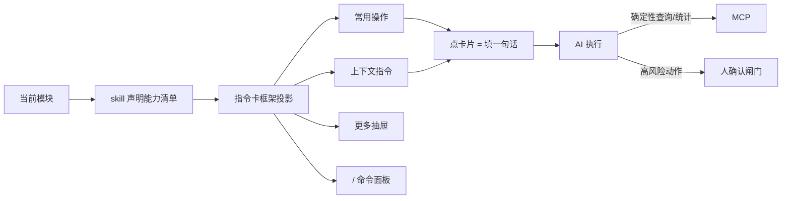

# Implementation Plan: AI 会话（右栏指令卡）

**Branch**: `006-ai-session` | **Date**: 2026-09-26 | **Spec**: `spec.md`

**Input**: Feature specification from `docs/superpowers/specs/006-ai-session/spec.md`

## Summary

落地右栏 AI 会话的通用「指令卡机制」：顶部常用操作、上下文指令、更多 skill 抽屉、`/` 命令面板。机制通用、内容随模块——各模块 skill 声明能力清单，框架自动投影。复用 opencode 原生右栏会话，是「薄界面 + 厚 skill」的可发现入口。

## Technical Context

**Language/Version**: TypeScript（Bun monorepo）

**Primary Dependencies**: opencode 原生 SessionSidePanel（右栏会话）、SolidJS

**Storage**: 无新存储（指令卡是前端 UI + skill 能力清单声明）

**Testing**: oxlint + turbo typecheck + bun test

**Target Platform**: 桌面浏览器（公安内网）

**Project Type**: web-app（opencode fork 前端）

**Performance Goals**: 指令卡渲染流畅、命令面板模糊匹配即时

**Constraints**: 复用 opencode 原生、机制通用内容随模块、高风险动作人确认

**Scale/Scope**: 1600 用户

## Constitution Check

*GATE: 逐条对照 constitution.md，违反 MUST 级原则 = CRITICAL 阻断。*

| 宪法原则 | 本 feature 的符合情况 | 结论 |
|---|---|---|
| I. 最小化上游合并冲突（NON-NEGOTIABLE） | 指令卡是新增 UI 组件，不碰 `sql.ts` | ✅ 无冲突 |
| II. 品牌化走配置（NON-NEGOTIABLE） | 不涉及品牌 | ✅ 不适用 |
| III. 物理隔离优先 | 不涉及用户数据隔离 | ✅ 不适用 |
| IV. 权限下沉执行层 | 指令卡只展示有权 skill（capability 过滤），鉴权在 F4 执行层硬拦 | ✅ 无冲突 |
| V. 侵入是「加」不是「改」 | 新增指令卡组件 + skill 能力清单声明接口，复用原生 SessionSidePanel | ✅ 无冲突 |

**结论**: 无 MUST 级原则违规。

## 项目文件结构（要素①）

```text
packages/app/src/
├── ai-session/
│   ├── instruction-cards.tsx    # 指令卡机制通用框架（投影 skill 能力清单）
│   ├── common-cards.tsx         # 顶部「常用操作」（固定一行 + 溢出收「⋯」）
│   ├── context-cards.tsx        # 「上下文指令」（随中栏选中动态浮现）
│   ├── skill-drawer.tsx         # 「更多 skill」抽屉（分组 + 最近使用 + 收藏加权）
│   └── command-palette.tsx      # `/` 命令面板（模糊匹配有权 skill）

skill/
└── （各模块 skill 声明能力清单，供指令卡框架投影）
```

**Structure Decision**: 指令卡机制集中在 `app/ai-session/`，复用 opencode 原生右栏会话；skill 能力清单声明接口是框架与各模块 skill 的契约。

## 前端换皮区（右栏会话 + 指令卡）

> 视觉真理来源：`../openhive-DESIGN.md` + opencode `theme.css`。本 feature 纯前端，复用 opencode 原生右栏会话 + 新增指令卡机制。

### ① opencode 原生组件 → openhive 改造

| opencode 组件 | openhive 改造 | 类型 |
|---|---|---|
| SessionSidePanel（右栏会话） | 复用 + 换皮（token）+ 顶部挂指令卡，不改内部 | 换皮 |
| opencode 无指令卡机制 | 指令卡通用框架（投影 skill 能力清单） | 新增 |
| opencode 无「更多 skill」抽屉 | 更多 skill 抽屉（分组 + 最近 + 收藏加权） | 新增 |
| opencode 的 command-palette（功能命令） | `/` 命令面板（模糊匹配有权 skill，语义不同） | 新增 |

### ② 语义 token（右栏，DESIGN.md §1/§4）

| 用途 | openhive 值 |
|---|---|
| 右栏输入框（Hero 输入） | 白底 + 16px 大圆角 + 柔和阴影（对话优先视觉中心） |
| 指令卡 | 白底卡片 + 柔和阴影 + 蜂蜜金高亮 |
| 选中态 / 链接 | 蜂蜜金 `#D97706`；浅金 `#FEF3C7` 选中底 |
| CTA | 暖黑 `#1C1A18` 底 + 白字，10px 圆角 |
| 字号 | 默认 14px（§2.2）；**不启用暗色** |

### ③ 视觉参考样本

- `../design-reference/figma-export/`
- front 组件：`RightAIChat`（右栏 AI 会话 / 指令卡 / 输入框）

### ④ 换皮 vs 新增

| 类型 | 本 feature 具体 |
|---|---|
| 换皮 | 右栏会话（SessionSidePanel token） |
| 新增 | 指令卡框架、常用操作、上下文指令、更多抽屉、`/` 命令面板 |

## 数据流向（要素②）



- 指令卡是 skill 能力的「投影」——框架只做通用 UI，能力由各模块 skill 声明，不重画一遍。
- 点卡片填入一句话 → AI 执行 → 确定性走 MCP、高风险走人确认闸门（F4 执行层兜底）。

## 依赖清单（要素③）

| 依赖 | 用途 | 说明 |
|---|---|---|
| Bun（monorepo） | 构建 / 运行 | opencode 既有工程 |
| SolidJS | 前端框架 | opencode 原生 |
| opencode SessionSidePanel | 右栏会话 | 复用会话消息流 / 会话管理 / 导出 |

## 与现有系统集成点（要素④）

- **复用 F1 右栏骨架**：F1 已定义右栏位置，本 feature 落地右栏 AI 会话与指令卡。
- **复用 F4 权限**：指令卡只展示有权 skill（capability 过滤），鉴权在执行层。
- **投影各模块 skill**：F6 资金 / F7 话单的特定指令卡内容已定义，本 feature 提供通用投影机制；F9 的 skill 治理落地后填充能力清单。
- **复用 opencode 原生**：会话管理、导出会话、模型选择器、Effort 等原生能力。

## 风险点清单（要素⑤）

| ID | 风险 | 缓解 |
|---|---|---|
| R1 | 指令卡机制与 opencode 原生右栏会话的集成边界（是否侵入 SessionSidePanel） | 指令卡作为独立组件挂到右栏顶部，不改 SessionSidePanel 内部 |
| R2 | skill 能力清单声明接口未标准化，各模块 skill 无法投影 | 先定声明接口契约，F6/F7 skill 按契约声明 |
| R3 | 指令卡投影在 skill 数量多时的渲染性能 | 常用操作固定一行 + 溢出收「⋯」，抽屉虚拟滚动 |
| R4 | prompt injection 诱导 AI 执行高风险动作 | 人确认闸门 + F4 执行层鉴权双层兜底 |
