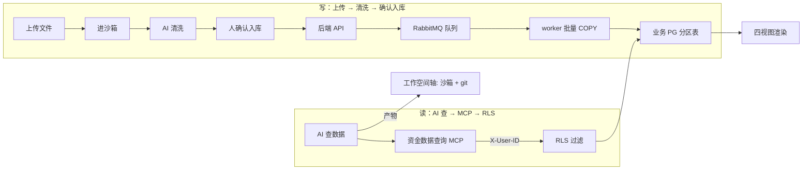

# Implementation Plan: 资金分析（数据轴示范）

**Branch**: `007-fund-analysis` | **Date**: 2026-09-26 | **Spec**: `spec.md`

**Input**: Feature specification from `docs/superpowers/specs/007-fund-analysis/spec.md`

## Summary

把传统资金分析工具重构为 openhive 项目内的三栏分析工作区：左栏资金项目树（数据轴）、中栏四个固定数据视图 + 沙箱文件 tab、右栏「资金分析 skill」驱动。读走「资金数据查询 MCP」+ RLS，写走后端 API + RabbitMQ 批量 COPY，图谱两层（事实层 PG + 思路层沙箱 .graph）。数据与工作空间彻底解耦。

## Technical Context

**Language/Version**: TypeScript（Bun monorepo）

**Primary Dependencies**: 自研「资金数据查询 MCP」「业务系统查询 MCP」、后端 API + RabbitMQ（异步队列）、AntV G6（图谱）、ECharts（桑基/统计）、PostgreSQL（分区 + RLS）

**Storage**: 业务 PG（`fund_*` 表，`fund_transaction` 按月分区 + RLS）；沙箱（产物 `.graph` / `.md` / 报告）

**Testing**: oxlint + turbo typecheck + bun test + 隔离测试（RLS 越权拦截）

**Target Platform**: 公安内网（服务端 + 桌面浏览器）

**Project Type**: web-service + web-app（opencode fork）

**Performance Goals**: 高峰日 200 万条流水，指定时间段明细查询秒级

**Constraints**: 数据与工作空间解耦、涉案数据只转换 + 标记、复用 opencode 最小侵入

**Scale/Scope**: 1600 用户，200 万条 / 日流水（约 7.3 亿条 / 年）

## Constitution Check

*GATE: 逐条对照 constitution.md，违反 MUST 级原则 = CRITICAL 阻断。*

| 宪法原则 | 本 feature 的符合情况 | 结论 |
|---|---|---|
| I. 最小化上游合并冲突（NON-NEGOTIABLE） | 资金分析是 openhive 自有模块（新增 `fund_*` 表 / MCP / skill），不碰 opencode core 的 `sql.ts` | ✅ 无冲突 |
| II. 品牌化走配置（NON-NEGOTIABLE） | 不涉及品牌 | ✅ 不适用 |
| III. 物理隔离优先 | 业务数据独立 PG + RLS（数据轴），与 core SQLite 分离；原始流水不落地工作空间 | ✅ 无冲突 |
| IV. 权限下沉执行层 | 读走 MCP 带 X-User-ID + RLS，写走 API + 队列；capability 三层拦截由 F4 承载 | ✅ 无冲突 |
| V. 侵入是「加」不是「改」 | `fund_*` 表新增、MCP 新增、skill 新增，不改 opencode core 既有逻辑 | ✅ 无冲突 |

**结论**: 无 MUST 级原则违规。

## 项目文件结构（要素①）

```text
packages/opencode/src/
├── fund/
│   ├── tables.ts                # fund_* 表 + 按月分区 + RLS 策略
│   ├── member.ts                # 微信群模型权限判定（数据轴）
│   ├── query.ts                 # 资金数据查询（时间跨度 MIN/MAX + 明细 + 聚合）
│   └── import.ts                # 批量 COPY 导入（RabbitMQ worker 消费）
├── mcp/
│   ├── fund-query/              # 自研「资金数据查询 MCP」（带 X-User-ID + RLS）
│   └── biz-query/               # 自研「业务系统查询 MCP」（持有人研判查证）

packages/app/src/
├── fund/
│   ├── project-tree.tsx         # 左栏四 tab + 项目树（邻接表）
│   ├── load-panel.tsx           # 数据加载面板（时间跨度 + 全部/指定时间段）
│   ├── views/
│   │   ├── detail-view.tsx      # 明细（join 持有人 + 账户对聚合窗口函数）
│   │   ├── aggregate-view.tsx   # 聚合统计（对方账户 GROUP BY）
│   │   ├── watchlist-view.tsx   # 关注清单（track_status 状态机）
│   │   └── sankey-view.tsx      # 桑基图（账户级汇总）
│   └── graph-canvas.tsx         # 图谱研判画布（.graph 思路层）

skill/
└── fund-analysis/               # 资金分析 skill（右栏能力编排）
```

**Structure Decision**: 后端 `fund/` + `mcp/`，前端 `app/fund/`，skill 独立目录；全部「加」的方式挂到 opencode 既有架构上。

## 前端换皮区（资金四视图 + 图谱画布）

> 视觉真理来源：`../openhive-DESIGN.md` + opencode `theme.css`。本 feature 前后端混合，前端集中在左栏资金树 + 中栏四视图 + 图谱画布。

### ① opencode 原生组件 → openhive 改造

| opencode 组件 | openhive 改造 | 类型 |
|---|---|---|
| F1 的 data-view 挂载点（内容视图注册表） | 四视图（明细 / 聚合 / 关注清单 / 桑基图）挂到注册表 | 复用（换皮挂载） |
| opencode 无资金项目树 | 左栏资金项目树（邻接表 + 拖拽 + 环检测） | 新增 |
| opencode 无数据加载面板 | 数据加载面板（时间跨度 + 全部 / 指定时间段） | 新增 |
| opencode 无图谱研判画布 | 图谱画布（.graph 思路层 + 拖入账户 / 手画节点） | 新增 |

### ② 语义 token（四视图 / 图谱，DESIGN.md §1/§3）

| 用途 | openhive 值 |
|---|---|
| 进账 / 出账 | 进账浅蓝底 `blue-50` + 蓝字；出账白底（§1.3） |
| 风险标记 | 高危红 `red-100/red-700`、极危紫 `purple-100/purple-700` |
| 已导入 / 完成 | 绿 `emerald-100/emerald-800` |
| 中栏视图容器 | 白底卡片 + 柔和阴影，16px 圆角 |
| 高亮 / 选中 | 蜂蜜金 `#D97706`、浅金 `#FEF3C7` |
| 字号 | 默认 14px（§2.2）；等宽显示账号 / 金额（§2.1） |

### ③ 视觉参考样本

- `../design-reference/figma-export/`
- front 组件：`CenterWorkspace`（中栏四视图：明细 / 聚合 / 关注清单 / 桑基图）

### ④ 换皮 vs 新增

| 类型 | 本 feature 具体 |
|---|---|
| 换皮 | 中栏四视图挂载点（复用 F1 data-view 注册表） |
| 新增 | 资金项目树、数据加载面板、四视图、图谱画布 |

## 数据流向（要素②）



- **数据轴**：业务 PG（`fund_*` + RLS），读走 MCP、写走 API + 队列，原始流水永不离 PG。
- **工作空间轴**：产物（报告/图谱/分析记录）落沙箱 + git，落地只记 project_id。
- **两轴解耦**：数据不因被某工作空间用过就属于它；产物不反向绑定数据。

## 依赖清单（要素③）

| 依赖 | 用途 | 说明 |
|---|---|---|
| Bun（monorepo） | 构建 / 运行 | opencode 既有工程 |
| PostgreSQL | 业务数据 | 按月分区 + 行级 RLS |
| RabbitMQ | 异步导入队列 | worker 消费 → 批量 COPY 写 PG |
| AntV G6 | 图谱渲染 | 事实层 relation 图 + 思路层 .graph 画布 |
| ECharts | 桑基图 / 统计图 | 账户级汇总 |
| 自研 MCP | 资金数据查询 / 业务系统查询 | 带 X-User-ID + RLS / capability 鉴权 |

> 聚合统计默认实时 GROUP BY，慢则上物化视图（升级信号，现在不触发）；图数据库（Apache AGE）现在不触发。

## 与现有系统集成点（要素④）

- **复用 F1 三栏**：中栏四视图挂「内容视图注册表」（按数据类型切换）；数据加载面板、面包屑复用 F1 框架。
- **复用 F3 沙箱**：图谱 `.graph`、分析记录 `.md` 落沙箱 + git。
- **复用 F4 权限**：读走 MCP（带 X-User-ID + RLS），写走 API；capability 三层拦截已由 F4 落地。
- **复用 F5 项目管理**：产物落到「当前工作的 openhive 项目」，与数据轴解耦（只记 project_id）。

## 风险点清单（要素⑤）

| ID | 风险 | 缓解 |
|---|---|---|
| R1 | 海量流水性能（200 万条 / 日），分区 + 批量 COPY 是否达标 | 按月分区 + 批量 COPY + 时间跨度走索引分区裁剪；压测验证 |
| R2 | 清洗红线（只转换 + 标记）被 LLM 语义层突破，误删/误判 | 后端规则引擎确定性 + LLM 只标记不删除；删除/判定强制人确认闸门 |
| R3 | 持有人研判的多候选 + 置信度依赖企业模型能力 | 规则 + 大模型校验，两闸门（线索确认 / 持有人判定）人拍板兜底 |
| R4 | 数据轴 / 工作空间轴解耦实现（产物落地只记 project_id） | 落地链路显式只写 project_id，不建关联表，隔离测试覆盖 |
