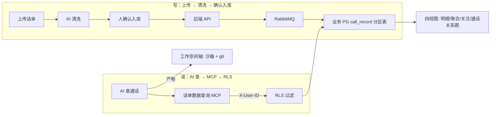

# Implementation Plan: 话单分析（数据轴，同构资金）

**Branch**: `008-call-analysis` | **Date**: 2026-09-26 | **Spec**: `spec.md`

**Input**: Feature specification from `docs/superpowers/specs/008-call-analysis/spec.md`

## Summary

话单分析与资金分析**同构**——复用同一套三栏、四视图、微信群权限、入库闭环、图谱画布、指令卡机制，差异仅在数据对象（号码 + 通话/短信记录）与两个特有部分：第 4 视图「通话关系图」（替代桑基图）、特有分析能力（新出现/消失号码、共同关系人、串码、关系分析，走 skill）。

## Technical Context

**Language/Version**: TypeScript（Bun monorepo）

**Primary Dependencies**: 自研「话单数据查询 MCP」、复用「业务系统查询 MCP」、后端 API + RabbitMQ、AntV G6（通话关系图 + 图谱）、ECharts（统计）、PostgreSQL（分区 + RLS）

**Storage**: 业务 PG（`call_*` 表，`call_record` 按月分区 + RLS）；沙箱（产物）

**Testing**: oxlint + turbo typecheck + bun test + 隔离测试（RLS 越权拦截）

**Target Platform**: 公安内网（服务端 + 桌面浏览器）

**Project Type**: web-service + web-app（opencode fork）

**Performance Goals**: 高峰日超百万条记录，指定时间段查询秒级

**Constraints**: 数据与工作空间解耦、只转换 + 标记、MVP 只通话不短信

**Scale/Scope**: 1600 用户，话单高峰日可超百万条

## Constitution Check

*GATE: 逐条对照 constitution.md，违反 MUST 级原则 = CRITICAL 阻断。*

| 宪法原则 | 本 feature 的符合情况 | 结论 |
|---|---|---|
| I. 最小化上游合并冲突（NON-NEGOTIABLE） | 话单分析是 openhive 自有模块（新增 `call_*` 表 / MCP / skill），不碰 `sql.ts` | ✅ 无冲突 |
| II. 品牌化走配置（NON-NEGOTIABLE） | 不涉及品牌 | ✅ 不适用 |
| III. 物理隔离优先 | 业务数据独立 PG + RLS，与 core SQLite 分离；原始记录不落地工作空间 | ✅ 无冲突 |
| IV. 权限下沉执行层 | 读走 MCP + RLS，写走 API + 队列；capability 三层拦截由 F4 承载 | ✅ 无冲突 |
| V. 侵入是「加」不是「改」 | `call_*` 表新增、MCP 新增、skill 新增，不改 opencode core | ✅ 无冲突 |

**结论**: 无 MUST 级原则违规。

## 项目文件结构（要素①）

> 与资金分析（F6）同构，`call_*` 对应 `fund_*`，复用同一套读写链路、图谱、指令卡机制。

```text
packages/opencode/src/
├── call/
│   ├── tables.ts                # call_* 表 + 按月分区 + RLS 策略
│   ├── member.ts                # 微信群模型权限（数据轴）
│   ├── query.ts                 # 话单数据查询（时间跨度 MIN/MAX + 明细 + 聚合）
│   └── import.ts                # 批量 COPY 导入（RabbitMQ worker）
├── mcp/
│   ├── call-query/              # 自研「话单数据查询 MCP」（带 X-User-ID + RLS）
│   └── biz-query/               # 复用「业务系统查询 MCP」（持有人研判查证）

packages/app/src/
├── call/
│   ├── project-tree.tsx         # 左栏四 tab + 项目树
│   ├── load-panel.tsx           # 数据加载面板
│   ├── views/
│   │   ├── detail-view.tsx      # 明细（join 持有人 + 号码对聚合）
│   │   ├── aggregate-view.tsx   # 聚合统计（对方号码 GROUP BY）
│   │   ├── watchlist-view.tsx   # 关注清单（track_status 状态机）
│   │   └── call-relation-view.tsx  # 通话关系图（号码级网络，AntV G6）
│   └── graph-canvas.tsx         # 图谱研判画布（.graph）

skill/
└── call-analysis/               # 话单分析 skill（含特有能力）
```

**Structure Decision**: 复用 F6 的 `fund/`、`mcp/fund-query/`、`app/fund/` 同构结构；`call-relation-view` 是唯一新增视图，`call-analysis` skill 是唯一新增 skill 能力集。

## 数据流向（要素②）



- 同资金分析：读 MCP / 写 API，业务数据留 PG（数据轴），产物落沙箱（工作空间轴），两轴解耦。

## 依赖清单（要素③）

| 依赖 | 用途 | 说明 |
|---|---|---|
| Bun（monorepo） | 构建 / 运行 | opencode 既有工程 |
| PostgreSQL | 业务数据 | 按月分区 + RLS |
| RabbitMQ | 异步导入队列 | worker 批量 COPY |
| AntV G6 | 通话关系图 + 图谱 | 号码级关系网络 + 事实层 relation + 思路层 .graph |
| ECharts | 统计图 | 聚合统计 |
| 自研 MCP | 话单数据查询 / 业务系统查询 | 复用 F6 的 biz-query |

## 与现有系统集成点（要素④）

- **复用 F6 资金分析的整套模式**：三栏、四视图（除第 4 视图）、权限、入库、图谱、指令卡机制全部复用，不重复造轮子。
- **复用 F1 / F3 / F4 / F5**：中栏视图挂内容视图注册表；产物落沙箱；读 MCP + RLS；产物落当前 openhive 项目。
- **号码→人映射复用全局 `account_identity`**：不新造表（design-v2 §12.1 全局实体库）。

## 风险点清单（要素⑤）

| ID | 风险 | 缓解 |
|---|---|---|
| R1 | 特有分析能力（共同关系人/串码/关系网络）依赖企业模型语义推断准确率 | 走 skill + 人确认闸门，AI 只推断不替民警下结论 |
| R2 | 通话关系图在全量号码上的渲染性能 | 号码级聚合 + AntV G6 力导图，钻取按需加载 |
| R3 | MVP「只通话不短信」的边界在清洗/线索提取处被突破 | 清洗引擎与线索提取显式排除短信，纳入验收 |
| R4 | 复用 F6 模式时的耦合（改 F6 需同步 F7） | 同构部分抽公共组件/服务，差异点独立模块 |
