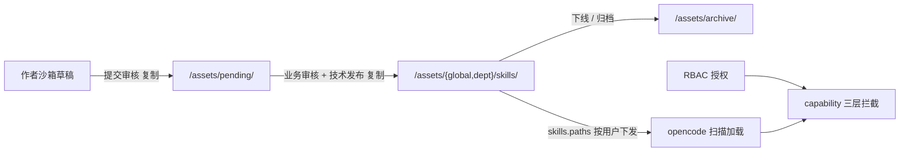

# Implementation Plan: AI 资产（Skill / MCP / 知识库）

**Branch**: `009-ai-assets` | **Date**: 2026-09-26 | **Spec**: `spec.md`

**Input**: Feature specification from `docs/superpowers/specs/009-ai-assets/spec.md`

## Summary

把 Skill / MCP / 知识库统一抽象为「资产」，用一套元数据、一套权限、一套生命周期治理。前端左栏纯导航 + 中栏浏览；资产生命周期 7 状态机（审核两道关分离）；权限走 RBAC + capability；Skill 制作自然语言主路径；MCP 授权三层 + 数据隔离四环。

## Technical Context

**Language/Version**: TypeScript（Bun monorepo）

**Primary Dependencies**: opencode 原生 skill / MCP、RAGFlow（知识库）、自研「资产治理 MCP server」+ 资产服务

**Storage**: `/assets`（共享资产层：pending / global / dept / archive）+ 作者沙箱 + RBAC 表（F4）

**Testing**: oxlint + turbo typecheck + bun test

**Target Platform**: 公安内网（docker 部署，`/assets` 共享卷）

**Project Type**: web-service + web-app（opencode fork）

**Performance Goals**: 资产浏览 / 搜索流畅，虚拟滚动承载海量资产

**Constraints**: 复用 opencode 原生、统一抽象、授权收藏分离

**Scale/Scope**: 1600 用户（并发活跃 20~30%）

## Constitution Check

*GATE: 逐条对照 constitution.md，违反 MUST 级原则 = CRITICAL 阻断。*

| 宪法原则 | 本 feature 的符合情况 | 结论 |
|---|---|---|
| I. 最小化上游合并冲突（NON-NEGOTIABLE） | 资产治理是 openhive 自有模块（资产服务 + MCP server + 前端），opencode 内核只被动扫描 skill 目录，不碰 `sql.ts` | ✅ 无冲突 |
| II. 品牌化走配置（NON-NEGOTIABLE） | 不涉及品牌 | ✅ 不适用 |
| III. 物理隔离优先 | `/assets` 是独立共享资产层（与用户沙箱分离），权限靠 RBAC + capability | ✅ 无冲突 |
| IV. 权限下沉执行层 | 授权走 RBAC + capability 三层拦截；提交/发布用 MCP 工具驱动（capability 鉴权，民警只签「提交」、管理员签「发布」） | ✅ 无冲突 |
| V. 侵入是「加」不是「改」 | 资产服务新增、MCP server 新增、前端新增，不改 opencode core 逻辑 | ✅ 无冲突 |

**结论**: 无 MUST 级原则违规。

## 项目文件结构（要素①）

```text
asset-service/                      # 自研资产服务
├── src/
│   ├── metadata.ts                 # 统一资产元数据 + 状态机
│   ├── lifecycle.ts                # 生命周期流转（提交/审核/发布/下线/归档）
│   ├── storage.ts                  # 物理存放（/assets 复制/删除/rename）
│   └── notify.ts                   # 站内信通知（状态变化推送到人）

packages/opencode/src/mcp/
└── asset-governance/               # 自研「资产治理 MCP server」
    ├── submit_skill_for_review.ts  # 提交审核（capability：作者）
    └── publish_skill.ts            # 发布（capability：管理员）

packages/app/src/
├── ai-assets/
│   ├── asset-nav.tsx               # 左栏纯导航（空间筛选 + 三 Tab + 分类折叠）
│   ├── asset-grid.tsx              # 中栏卡片网格（虚拟滚动）
│   ├── asset-search.tsx            # 全局搜索
│   └── asset-detail.tsx            # 详情 tab（介绍/注意事项/评价/版本）
```

> 物理存放约定（design-v2 §11.6）：`/assets/pending/{name}/`（待审）、`/assets/global/skills/{name}/`、`/assets/dept/{deptId}/skills/{name}/`、`/assets/archive/{name}/`；作者沙箱 `/workspaces/{authorId}/{project}/`（草稿）。

**Structure Decision**: 资产服务独立（负责建目录/复制/状态机），opencode 内核只被动扫描 skill 目录加载；前端 `app/ai-assets/` 承载浏览。

## 前端换皮区（资产浏览：左栏导航 + 中栏卡片网格）

> 视觉真理来源：`../openhive-DESIGN.md` + opencode `theme.css`。本 feature 前后端混合，前端是「左栏纯导航 + 中栏浏览」（薄界面 + 厚 skill，界面只浏览不承载分析）。

### ① opencode 原生组件 → openhive 改造

| opencode 组件 | openhive 改造 | 类型 |
|---|---|---|
| opencode 无资产浏览界面 | 左栏纯导航（空间筛选 + 三 Tab + 分类折叠） | 新增 |
| opencode 无资产卡片网格 | 中栏卡片网格（虚拟滚动）+ 全局搜索 | 新增 |
| opencode 无资产详情页 | 详情 tab（介绍 / 注意事项 / 评价 / 版本） | 新增 |
| F6 右栏 AI 对话 | Skill 制作入口（自然语言生成 skill 落沙箱） | 复用右栏 + 新增入口 |

### ② 语义 token（资产浏览，DESIGN.md §1/§3）

| 用途 | openhive 值 |
|---|---|
| 资产卡片 | 白底卡片 + 柔和阴影 + 16px 圆角 |
| 选中态 / 高亮 | 蜂蜜金 `#D97706`、浅金 `#FEF3C7` |
| 资产图标 | 六边形轮廓包裹（§5.3） |
| 分类 / Tab | 14px 小字，弱化 |
| CTA | 暖黑 `#1C1A18` 底 + 白字，10px 圆角 |
| 字号 | 默认 14px（§2.2）；**不启用暗色** |

### ③ 视觉参考样本

- `../design-reference/figma-export/`
- front 组件：`ResourceMarketplace`（资源市场：卡片网格 / 详情 / 搜索）

### ④ 换皮 vs 新增

| 类型 | 本 feature 具体 |
|---|---|
| 换皮 | 无（前端以「浏览资产」为主，全为新增） |
| 新增 | 左栏导航、卡片网格、全局搜索、详情 tab、Skill 制作入口 |

## 数据流向（要素②）



- **资产轴**：作者沙箱 → pending → 发布目录 → 归档，资产服务执行复制/删除/rename。
- **权限**：RBAC 授权 → capability 三层拦截（工具清单过滤 / 执行鉴权 / MCP 账号兜底），复用 F4。
- **发现渠道**：全局/部门走 `skills.paths`（登录时按用户部门 + 全局自动拼写），个人走原生项目目录。

## 依赖清单（要素③）

| 依赖 | 用途 | 说明 |
|---|---|---|
| Bun（monorepo） | 构建 / 运行 | opencode 既有工程 |
| opencode 原生 skill / MCP | 资产载体 | 内核被动扫描，资产服务建目录 |
| RAGFlow | 知识库 | RAG 资料库 |
| 自研「资产治理 MCP server」 | 提交/发布工具 | 工具驱动，鉴权靠 capability |
| 进程内 TTL Map 缓存 | 授权映射缓存 | 不上 Redis（规模未到），接口先行（AuthCache 抽象） |

## 与现有系统集成点（要素④）

- **复用 F4 RBAC**：授权组 = `role_type='group'` 的自定义 role，复用 role / user_role / role_resource 三张表，不新造权限体系。
- **复用 F8 指令卡**：收藏加权影响「更多 skill」抽屉排序；详情页「▶ 执行此 skill」填入指令。
- **opencode 内核边界**：内核只被动扫描 skill 目录（不建目录、不复制、不懂待审/发布），资产服务执行全动作；提交/发布用 MCP 工具驱动，不用 skill。

## 风险点清单（要素⑤）

| ID | 风险 | 缓解 |
|---|---|---|
| R1 | 资产服务与 opencode 内核边界（内核不建目录，资产服务做全动作） | 严格分工：内核被动扫描，资产服务 `mkdir -p` 幂等建目录 |
| R2 | Skill「可泛化性」审核的落地（业务专家判断） | 业务管理员审内容 + 可泛化性，AI 只辅助；审核权在业务专家（§11.3） |
| R3 | MCP 连接身份注入可靠性（数据隔离四环缺一环漏数据） | 下发带身份 + 服务端 RLS，隔离测试覆盖 |
| R4 | 海量资产搜索/浏览性能 | 虚拟滚动 + 进程内缓存 + 接口先行（AuthCache 抽象） |
