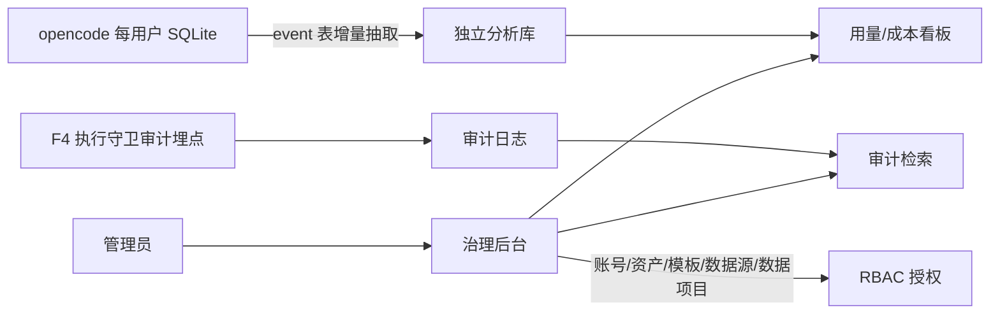

# Implementation Plan: 治理后台

**Branch**: `010-governance-console` | **Date**: 2026-09-26 | **Spec**: `spec.md`

**Input**: Feature specification from `docs/superpowers/specs/010-governance-console/spec.md`

## Summary

治理后台是「一个系统的两个视图」——复用同一套登录 + is_admin + RBAC，不单独部署。承载八大类管理动作（账号 / 组织 / 用量成本 / 审计 / AI 资产治理 / 模板库 / 数据源配置 / 数据项目权限），两类管理员分权。只承载「配置 + 审核 + 查看」。

## Technical Context

**Language/Version**: TypeScript（Bun monorepo）

**Primary Dependencies**: opencode 原生登录 / is_admin / RBAC、分析库（event 表 + SyncEvent 增量抽取）

**Storage**: RBAC 表（F4）、独立分析库（MVP 聚合 SQLite）、审计日志

**Testing**: oxlint + turbo typecheck + bun test

**Target Platform**: 公安内网（服务端 + 桌面浏览器）

**Project Type**: web-service + web-app（opencode fork）

**Performance Goals**: 管理动作流畅，审计检索秒级

**Constraints**: 一个系统两个视图、复用登录 + is_admin + RBAC、不单独部署

**Scale/Scope**: 1600 用户（管理员少数）

## Constitution Check

*GATE: 逐条对照 constitution.md，违反 MUST 级原则 = CRITICAL 阻断。*

| 宪法原则 | 本 feature 的符合情况 | 结论 |
|---|---|---|
| I. 最小化上游合并冲突（NON-NEGOTIABLE） | 治理后台是 openhive 自有模块，复用登录 + is_admin（配置），不碰 `sql.ts` | ✅ 无冲突 |
| II. 品牌化走配置（NON-NEGOTIABLE） | 复用 F1 视觉规范（蜂蜜金品牌色，配置/样式层） | ✅ 无冲突 |
| III. 物理隔离优先 | 治理后台不破坏用户隔离；管理员兜底（撤销/归档）在数据轴层面执行 | ✅ 无冲突 |
| IV. 权限下沉执行层 | 分权靠 is_admin + RBAC + capability，不靠前端隐藏 | ✅ 无冲突 |
| V. 侵入是「加」不是「改」 | 新增治理后台视图 + 管理动作，不改 opencode core | ✅ 无冲突 |

**结论**: 无 MUST 级原则违规。

## 项目文件结构（要素①）

```text
packages/app/src/
├── governance/
│   ├── console.tsx               # 治理后台全屏视图（一个系统两个视图）
│   ├── account-manage.tsx        # 账号管理（列表 + 录入 + 重置 + 停用 + 僵尸清理）
│   ├── org-tree.tsx              # 组织架构（org/dept/section 三级树）
│   ├── usage-cost.tsx            # 用量/成本看板
│   ├── audit-log.tsx             # 审计日志检索
│   ├── asset-governance.tsx      # AI 资产治理（审核/发布/上下架）
│   ├── template-lib.tsx          # 模板库（报告/图谱样式/报表口径）
│   ├── data-source.tsx           # 数据源配置（注册 + connector + 血缘）
│   └── data-project-perm.tsx     # 数据项目权限（管理员兜底）

packages/opencode/src/
├── governance/
│   ├── analytics.ts              # 分析库（event 表增量抽取 → 用量/成本）
│   └── audit.ts                  # 审计日志存储 + 检索
```

**Structure Decision**: 治理后台独立全屏视图（`app/governance/`），复用登录 + is_admin + RBAC，不单独部署；分析库复用 opencode event 表增量抽取。

## 前端换皮区（治理后台全屏视图）

> 视觉真理来源：`../openhive-DESIGN.md` + opencode `theme.css`。本 feature 前后端混合，前端是「治理后台全屏视图 + 8 大管理界面」，复用 F1 视觉规范（一个系统两个视图，不单独部署）。

### ① opencode 原生组件 → openhive 改造

| opencode 组件 | openhive 改造 | 类型 |
|---|---|---|
| opencode 无治理后台 | 治理后台全屏视图（顶栏入口，管理员进入） | 新增 |
| opencode 无 8 大管理界面 | 账号 / 组织 / 用量成本 / 审计 / 资产治理 / 模板库 / 数据源 / 数据项目权限 | 新增 |
| 复用 F2 账号 / F9 资产治理 / F6-F7 数据项目 | 后台承载对应管理动作 | 复用（后端机制） |

### ② 语义 token（治理后台，DESIGN.md §1/§3）

| 用途 | openhive 值 |
|---|---|
| 后台底色 | 暖白 `#FCFCFC`，白底卡片 + 柔和阴影 + 16px 圆角 |
| 表格 | 紧凑、sticky 表头，等宽显示账号 / 编号 |
| 高亮 / 选中 | 蜂蜜金 `#D97706`、浅金 `#FEF3C7` |
| 危险操作 | 红 `red-100/red-700`（停用 / 撤销 / 归档） |
| CTA | 暖黑 `#1C1A18` 底 + 白字，10px 圆角 |
| 字号 | 默认 14px（§2.2）；**不启用暗色** |

### ③ 视觉参考样本

- `../design-reference/figma-export/`
- front 组件：`AdminUserManagement`（治理后台 / 用户管理）

### ④ 换皮 vs 新增

| 类型 | 本 feature 具体 |
|---|---|
| 换皮 | 无（治理后台是 openhive 全新功能，全新增） |
| 新增 | 治理后台全屏视图 + 8 大管理界面 |

## 数据流向（要素②）



- **分析库**：复用 opencode 事件溯源（event 表 + SyncEvent）增量抽取 prompt + 元数据，供用量/成本看板。
- **审计**：F4 已埋 AccessDenied 审计点，本 feature 承载检索界面。
- **分权**：治理后台所有动作经 RBAC + capability，两类管理员各见各的功能。

## 依赖清单（要素③）

| 依赖 | 用途 | 说明 |
|---|---|---|
| Bun（monorepo） | 构建 / 运行 | opencode 既有工程 |
| opencode 原生登录 / is_admin / RBAC | 复用 | 一个系统两个视图，不单独部署 |
| opencode event 表 + SyncEvent | 分析库 | 增量抽取 prompt + 元数据 |

## 与现有系统集成点（要素④）

- **复用 F2 账号机制**：账号管理承载 F2 的录入/重置/停用/僵尸清理。
- **复用 F9 资产治理**：AI 资产治理承载 F9 的审核/发布/上下架。
- **复用 F6/F7 数据项目权限**：管理员兜底撤销/归档（owner 调离场景）。
- **复用 F4**：审计埋点 + RBAC 分权 + capability。

## 风险点清单（要素⑤）

| ID | 风险 | 缓解 |
|---|---|---|
| R1 | 分析库 event 表增量抽取的性能与一致性 | 复用 SyncEvent 增量，抽取幂等，压测验证 |
| R2 | 两类管理员分权的权限矩阵边界（is_admin + RBAC） | 显式权限矩阵 + 分权测试（各见各的功能） |
| R3 | 数据源 connector（P2 后手）的接口预留 | 留 connector 接口，MVP 手动上传，不预实现 |
| R4 | 治理后台只承载「配置+审核+查看」的边界被突破 | 后台不接入民警分析工作区，职责分离验收 |
